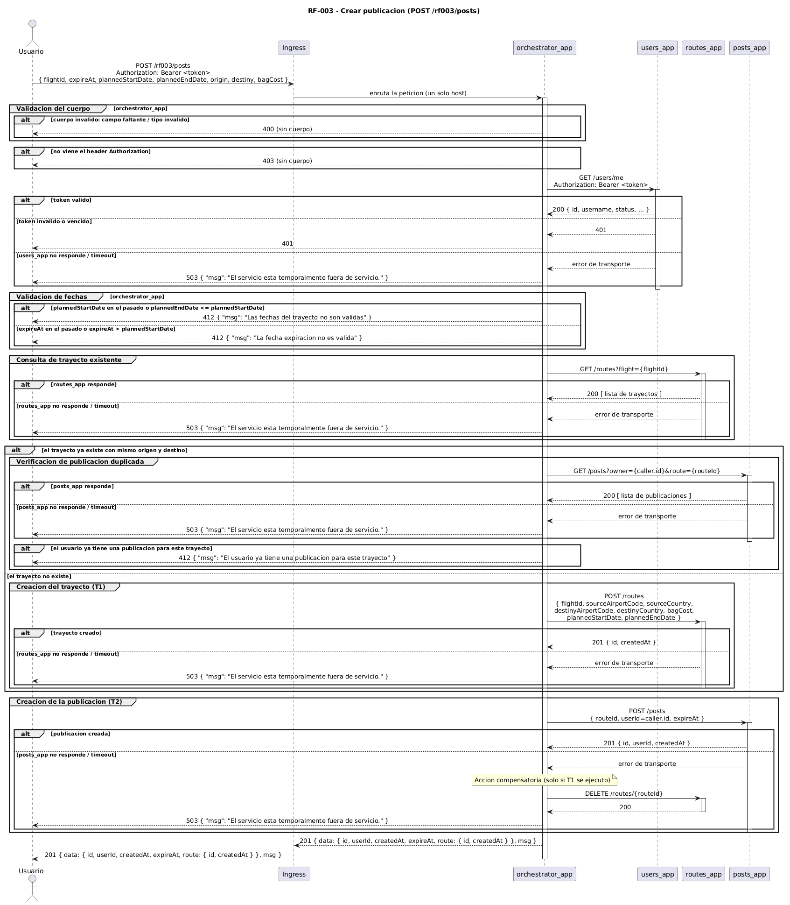

# RF-003 - Crear publicaciones

[← Volver al inicio](../README.md) · [Página de patrones de solución](../patrones-solucion.md)

## Tabla de contenido

- [RF-003 - Crear publicaciones](#rf-003---crear-publicaciones)
  - [Tabla de contenido](#tabla-de-contenido)
  - [Historia y criterios de aceptación](#historia-y-criterios-de-aceptación)
  - [Contrato del endpoint](#contrato-del-endpoint)
  - [Componentes involucrados](#componentes-involucrados)
  - [Modelo de secuencia](#modelo-de-secuencia)
  - [Explicación paso a paso](#explicación-paso-a-paso)
    - [Flujo principal](#flujo-principal)
    - [Flujos de excepción y manejo de errores](#flujos-de-excepción-y-manejo-de-errores)
  - [Consistencia de datos](#consistencia-de-datos)
  - [Patrones de solución](#patrones-de-solución)

## Historia y criterios de aceptación

> Como usuario deseo crear publicaciones para que otros usuarios puedan ofertar por ellas.

Criterios de aceptación:

- El usuario brinda los datos de la publicación y el trayecto que hará.
- Se valida si el trayecto ya existe o no; si no existe se crea con los valores indicados y se usa ese para la creación de la publicación; si ya existe se descartan los datos brindados y se usa el que está almacenado.
- La publicación queda asociada al usuario de la sesión.
- La plataforma solo permite crear publicaciones cuando la fecha de inicio de viaje es en el futuro.
- La plataforma solo permite crear publicaciones cuando la fecha de expiración de la publicación es posterior a la fecha actual y anterior o igual a la fecha de inicio de viaje.
- Si el usuario ya tiene otra publicación para el mismo trayecto, se rechaza la creación.
- Solo un usuario autenticado puede realizar esta operación.
- En cualquier caso de error la información en las bases de datos debe ser consistente al finalizar.

## Contrato del endpoint

| Elemento | Valor |
|---|---|
| Método | `POST` |
| Ruta | `/rf003/posts` |
| Encabezado | `Authorization: Bearer <token>` |
| Cuerpo | `{ "flightId": string, "expireAt": ISO datetime, "plannedStartDate": ISO datetime, "plannedEndDate": ISO datetime, "origin": { "airportCode": string, "country": string }, "destiny": { "airportCode": string, "country": string }, "bagCost": number }` |

| Código | Situación |
|---|---|
| `201` | Publicación creada. Cuerpo: `{ "data": { "id", "userId", "createdAt", "expireAt", "route": { "id", "createdAt" } }, "msg": "<resumen>" }` |
| `400` | Cuerpo incompleto o con formato inválido |
| `401` | Token no válido o vencido |
| `403` | La solicitud no incluye el token |
| `412` | Las fechas del trayecto no son válidas (pasado o no consecutivas) |
| `412` | La fecha de expiración no es válida |
| `412` | El usuario ya tiene una publicación para el mismo trayecto |
| `503` | Falla de integración con un componente: `{ "msg": "El servicio está temporalmente fuera de servicio." }` |

## Componentes involucrados

| Componente | Rol en RF-003 |
|---|---|
| Ingress | Punto de acceso único del sistema. Enruta `/rf003/*` hacia `orchestrator_app`. |
| `orchestrator_app` | Componente nuevo. Orquesta el flujo, valida las reglas de RF-003 y coordina la consistencia. No tiene base de datos. |
| `users_app` | Valida el token y resuelve el usuario de la sesión (`GET /users/me`). Sin cambios. |
| `routes_app` | Consulta si el trayecto existe (`GET /routes?flight={id}`), crea el trayecto si no existe (`POST /routes`) y ofrece la compensación (`DELETE /routes/{id}`). Sin cambios. |
| `posts_app` | Verifica si el usuario ya tiene una publicación para el trayecto (`GET /posts?owner={id}&route={id}`) y persiste la publicación (`POST /posts`). Sin cambios. |

## Modelo de secuencia

Fuente PlantUML: [`diagrams/rf003-sequence.puml`](../diagrams/rf003-sequence.puml).

## Explicación paso a paso

### Flujo principal

1. El usuario envía **una sola** petición `POST /rf003/posts` al host del sistema, con el token en el encabezado y los datos de la publicación en el cuerpo.
2. El **Ingress** reconoce el prefijo `/rf003` y enruta la petición al Service de `orchestrator_app`. El cliente nunca conoce ni llama a los servicios de dominio de forma directa.
3. `orchestrator_app` valida el cuerpo: todos los campos presentes y con el formato correcto.
4. `orchestrator_app` llama a `users_app` con `GET /users/me` reenviando el token. La respuesta identifica al usuario de la sesión (`caller`). `orchestrator_app` no reimplementa la validación del token: delega en el servicio dueño de esa responsabilidad.
5. `orchestrator_app` valida las fechas localmente:
   - `plannedStartDate` debe ser futura.
   - `plannedEndDate` debe ser posterior a `plannedStartDate`.
   - `expireAt` debe ser posterior a la fecha actual y anterior o igual a `plannedStartDate`.
6. `orchestrator_app` llama a `routes_app` con `GET /routes?flight={flightId}` para consultar si el trayecto ya existe con el mismo origen y destino.
7. **Si el trayecto existe:** `orchestrator_app` llama a `posts_app` con `GET /posts?owner={callerId}&route={routeId}` para verificar que el usuario no tenga ya una publicación para ese trayecto. Si ya existe, responde `412`.
8. **Si el trayecto no existe:** `orchestrator_app` llama a `routes_app` con `POST /routes` para crearlo. Esta es la primera subtransacción (**T1**).
9. `orchestrator_app` llama a `posts_app` con `POST /posts` para crear la publicación asociada al trayecto y al `caller`. Esta es la segunda subtransacción (**T2**).
10. `orchestrator_app` responde `201` con el resumen de la operación. El Ingress devuelve la respuesta al usuario.

### Flujos de excepción y manejo de errores

| Paso | Condición | Respuesta | Manejo |
|---|---|---|---|
| 3 | Cuerpo inválido o campos faltantes | `400` | Validación local en `orchestrator_app`, antes de cualquier llamada saliente. |
| 4 | Falta el encabezado `Authorization` | `403` | Validación local. |
| 4 | `users_app` responde `401`/`403` | `401` | Se traduce a token inválido. |
| 4, 6, 7, 8, 9 | Un servicio no responde o supera el tiempo de espera | `503` | Se aplica un tiempo de espera por llamada y un reintento solo en las lecturas (`GET`); si aun así falla, se traduce a `503`. Nunca se propaga un `500`. |
| 5 | Fechas del trayecto en el pasado o no consecutivas | `412` | Validación local sin llamadas salientes. |
| 5 | `expireAt` en el pasado o posterior a `plannedStartDate` | `412` | Validación local sin llamadas salientes. |
| 7 | El usuario ya tiene una publicación para el trayecto | `412` | Se rechaza antes de crear nada. |
| 9 | `posts_app` falla después de crear el trayecto en T1 | `503` | Se ejecuta la **compensación**: `orchestrator_app` llama a `routes_app` con `DELETE /routes/{routeId}` para eliminar el trayecto huérfano y responde `503`. Si la compensación también falla, se registra en el log y se responde `503` de todos modos. |

## Consistencia de datos

RF-003 escribe en dos servicios: `routes_app` (el trayecto, solo si no existía) y `posts_app` (la publicación). El criterio de aceptación exige que, ante cualquier error, las bases de datos queden consistentes.

`orchestrator_app` resuelve esto como una **Saga por orquestación** con una única subtransacción compensable:

| Paso | Subtransacción | Compensación |
|---|---|---|
| T1 | `POST /routes` en `routes_app` (solo si el trayecto no existía) | C1: `DELETE /routes/{routeId}` en `routes_app` |
| T2 | `POST /posts` en `posts_app` | No aplica, debido a que es el último paso |

Si T2 falla, `orchestrator_app` invoca C1 para eliminar el trayecto recién creado y responde `503`. Si el trayecto ya existía antes de la operación, no se ejecuta compensación porque T1 no se ejecutó. No se usa `two-phase commit` porque introduce un coordinador transaccional que bloquea recursos y se convierte en punto único de fallo, algo desaconsejado entre microservicios.

## Patrones de solución

Los patrones que resuelven RF-003, con su justificación y atributos de calidad, están documentados en la [página de patrones de solución](../patrones-solucion.md#rf-003---crear-publicaciones), en la tabla común a todos los requerimientos.