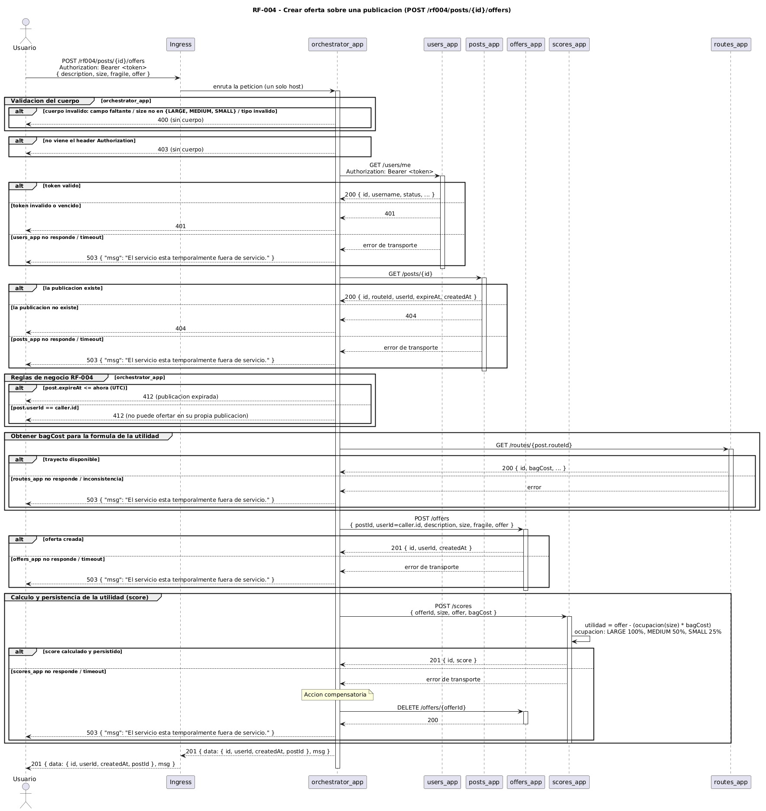

# RF-004 - Crear ofertas

[← Volver al inicio](../README.md) · [Página de patrones de solución](../patrones-solucion.md)

## Tabla de contenido

- [RF-004 - Crear ofertas](#rf-004---crear-ofertas)
  - [Tabla de contenido](#tabla-de-contenido)
  - [Historia y criterios de aceptación](#historia-y-criterios-de-aceptación)
  - [Contrato del endpoint](#contrato-del-endpoint)
  - [Componentes involucrados](#componentes-involucrados)
  - [Modelo de secuencia](#modelo-de-secuencia)
  - [Explicación paso a paso](#explicación-paso-a-paso)
    - [Flujo principal](#flujo-principal)
    - [Flujos de excepción y manejo de errores](#flujos-de-excepción-y-manejo-de-errores)
  - [Consistencia de datos](#consistencia-de-datos)
  - [Patrones de solución](#patrones-de-solución)

## Historia y criterios de aceptación

> Como usuario deseo ofertar sobre alguna publicación de otro usuario para poder contratar un servicio.

Criterios de aceptación:

- El usuario brinda la información de la oferta y el identificador de la publicación a la que se realiza.
- Se valida que la publicación existe.
- Solo es posible crear la oferta si la publicación no ha expirado.
- La oferta queda asociada al usuario de la sesión.
- El usuario no debe poder ofertar en sus publicaciones.
- Se calcula la utilidad (score) de la oferta.
- Solo un usuario autenticado puede realizar esta operación.
- En cualquier caso de error la información en las bases de datos debe ser consistente al finalizar.

## Contrato del endpoint

| Elemento | Valor |
|---|---|
| Método | `POST` |
| Ruta | `/rf004/posts/{id}/offers` |
| Encabezado | `Authorization: Bearer <token>` |
| Cuerpo | `{ "description": string, "size": "LARGE" \| "MEDIUM" \| "SMALL", "fragile": boolean, "offer": number }` |

| Código | Situación |
|---|---|
| `201` | Oferta creada. Cuerpo: `{ "data": { "id", "userId", "createdAt", "postId" }, "msg": "<resumen>" }` |
| `400` | Cuerpo incompleto, con formato inválido o `size` fuera del conjunto permitido |
| `401` | Token no válido o vencido |
| `403` | La solicitud no incluye el token |
| `404` | La publicación no existe |
| `412` | La publicación ya expiró, o la publicación es del mismo usuario |
| `503` | Falla de integración con un componente: `{ "msg": "El servicio está temporalmente fuera de servicio." }` |

## Componentes involucrados

| Componente | Rol en RF-004 |
|---|---|
| Ingress | Punto de acceso único del sistema. Enruta `/rf004/*` hacia `orchestrator_app`. |
| `orchestrator_app` | Componente nuevo. Orquesta el flujo, valida las reglas de RF-004 y coordina la consistencia. No tiene base de datos. |
| `users_app` | Valida el token y resuelve el usuario de la sesión (`GET /users/me`). Sin cambios. |
| `posts_app` | Entrega la publicación objetivo (`GET /posts/{id}`). Sin cambios. |
| `routes_app` | Entrega el `bagCost` del trayecto (`GET /routes/{id}`), consultado por `orchestrator_app`. Sin cambios. |
| `offers_app` | Persiste la oferta (`POST /offers`) y ofrece la compensación (`DELETE /offers/{id}`). Sin cambios. |
| `scores_app` | Componente nuevo. Aplica la fórmula de la utilidad con las entradas que le envía `orchestrator_app` y persiste el resultado. No consulta a otros servicios de dominio. |

> Estado de la integración: `orchestrator_app` define el puerto de salida hacia `scores_app` (`ScorePort`) y lo implementa con un adaptador HTTP real; el flujo completo, incluido el paso de utilidad, ya está implementado y probado de punta a punta.

## Modelo de secuencia

Fuente PlantUML: [`diagrams/rf004-sequence.puml`](../diagrams/rf004-sequence.puml).

## Explicación paso a paso

### Flujo principal

1. El usuario envía **una sola** petición `POST /rf004/posts/{id}/offers` al host del sistema, con el token en el encabezado y la oferta en el cuerpo.
2. El **Ingress** reconoce el prefijo `/rf004` y enruta la petición al Service de `orchestrator_app`. El cliente nunca conoce ni llama a los servicios de dominio de forma directa.
3. `orchestrator_app` valida el cuerpo: los cuatro campos presentes, `size` dentro de `{LARGE, MEDIUM, SMALL}` y `fragile` de tipo booleano.
4. `orchestrator_app` llama a `users_app` con `GET /users/me` reenviando el token. La respuesta identifica al usuario de la sesión (`caller`). `orchestrator_app` no reimplementa la validación del token: delega en el servicio dueño de esa responsabilidad.
5. `orchestrator_app` llama a `posts_app` con `GET /posts/{id}` y obtiene la publicación (`id`, `routeId`, `userId`, `expireAt`).
6. `orchestrator_app` aplica las reglas de negocio propias de RF-004, que ningún servicio de dominio conoce:
   - la publicación no ha expirado (`expireAt` mayor que la hora actual en UTC);
   - la publicación no pertenece al `caller`.
7. `orchestrator_app` llama a `routes_app` con `GET /routes/{routeId}` y obtiene el `bagCost` del trayecto. Es una entrada de la fórmula de la utilidad y se obtiene **antes** de crear la oferta, para que un fallo de `routes_app` no obligue a compensar. `scores_app` no consulta a `routes_app`.
8. `orchestrator_app` llama a `offers_app` con `POST /offers`, asociando la oferta al `caller`. Esta es la primera subtransacción (**T1**).
9. `orchestrator_app` solicita a `scores_app` el cálculo y la persistencia de la utilidad, enviándole `offerId`, `size`, `offer` y `bagCost` (subtransacción **T2**). `scores_app` aplica la fórmula `utilidad = offer - (ocupación(size) * bagCost)`, con ocupación `LARGE` 100 %, `MEDIUM` 50 %, `SMALL` 25 %.
10. `orchestrator_app` responde `201` con el resumen de la operación. El Ingress devuelve la respuesta al usuario.

### Flujos de excepción y manejo de errores

| Paso | Condición | Respuesta | Manejo |
|---|---|---|---|
| 3 | Cuerpo inválido o `size` fuera del conjunto | `400` | Validación local en `orchestrator_app`, antes de cualquier llamada saliente. |
| 4 | Falta el encabezado `Authorization` | `403` | Validación local. |
| 4 | `users_app` responde `401`/`403` | `401` | Se traduce a token inválido. |
| 4, 5, 7, 8 | Un servicio no responde o supera el tiempo de espera | `503` | Se aplica un tiempo de espera por llamada y un reintento **solo** en las lecturas (`GET`); si aun así falla, se traduce a `503` con el mensaje del contrato. Nunca se propaga un `500`. |
| 5 | `posts_app` responde `404` | `404` | La publicación no existe. |
| 6 | `expireAt` menor o igual a la hora actual | `412` | Publicación expirada. |
| 6 | `post.userId == caller.id` | `412` | El usuario no puede ofertar en su propia publicación. |
| 7 | `routes_app` no entrega el trayecto de la publicación | `503` | Es una inconsistencia de integración, no un error del cliente; la oferta aún no se ha creado, así que no hay que compensar. |
| 9 | `scores_app` falla después de crear la oferta | `503` | Se ejecuta la **compensación**: `orchestrator_app` llama a `offers_app` con `DELETE /offers/{offerId}` y responde `503`. Si la compensación también falla, se registra en el log y se responde `503` de todos modos. |

## Consistencia de datos

RF-004 escribe en dos servicios: `offers_app` (la oferta) y `scores_app` (la utilidad). El criterio de aceptación exige que, ante cualquier error, las bases de datos queden consistentes.

`orchestrator_app` resuelve esto como una **Saga por orquestación** con una única subtransacción compensable:

| Paso | Subtransacción | Compensación |
|---|---|---|
| T1 | `POST /offers` en `offers_app` | C1: `DELETE /offers/{offerId}` en `offers_app` |
| T2 | `POST /scores` en `scores_app` | No aplica: es el último paso |

Si T2 falla, `orchestrator_app` invoca C1 y responde `503`. No se usa `two-phase commit` porque introduce un coordinador transaccional que bloquea recursos y se convierte en punto único de fallo, algo desaconsejado entre microservicios. No se usa un motor de Saga con log distribuido porque el alcance de RF-004 (una sola subtransacción a revertir, flujo síncrono de corta duración) no lo justifica.

## Patrones de solución

Los patrones que resuelven RF-004, con su justificación y atributos de calidad, están documentados en la [página de patrones de solución](../patrones-solucion.md#rf-004---crear-ofertas), en la tabla común a todos los requerimientos.
