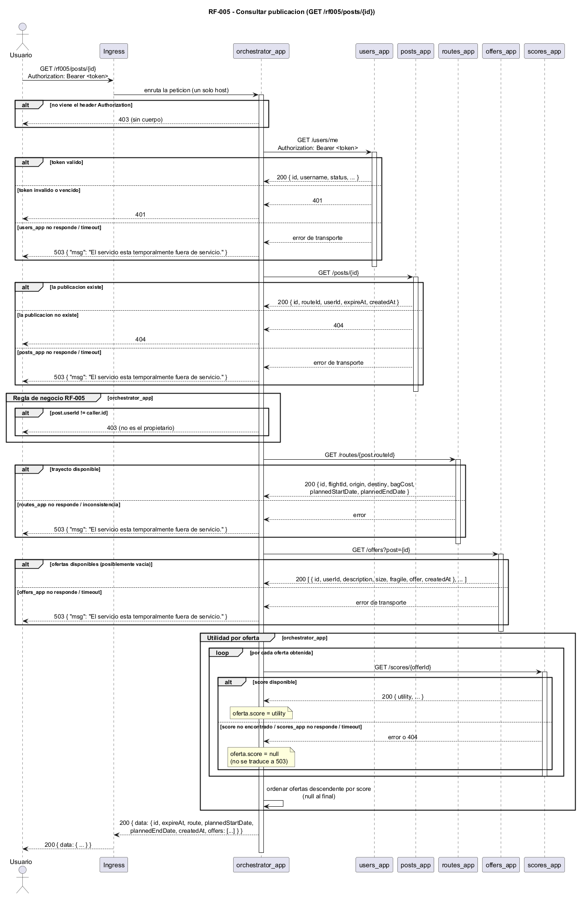

# RF-005 - Consultar publicaciones

[← Volver al inicio](../README.md) · [Página de patrones de solución](../patrones-solucion.md)

## Tabla de contenido

- [RF-005 - Consultar publicaciones](#rf-005---consultar-publicaciones)
  - [Tabla de contenido](#tabla-de-contenido)
  - [Historia y criterios de aceptación](#historia-y-criterios-de-aceptación)
  - [Contrato del endpoint](#contrato-del-endpoint)
  - [Componentes involucrados](#componentes-involucrados)
  - [Modelo de secuencia](#modelo-de-secuencia)
  - [Explicación paso a paso](#explicación-paso-a-paso)
    - [Flujo principal](#flujo-principal)
    - [Flujos de excepción y manejo de errores](#flujos-de-excepción-y-manejo-de-errores)
  - [Degradación ante fallas parciales](#degradación-ante-fallas-parciales)
  - [Patrones de solución](#patrones-de-solución)

## Historia y criterios de aceptación

> Como usuario deseo que cuando consulte una de mis publicaciones, esta contenga de manera ordenada descendente por utilidad, las ofertas que han realizado otros usuarios y así no invertir tiempo innecesario eligiendo la mejor.

Criterios de aceptación:

- El usuario brinda el identificador de la publicación que desea consultar y se retorna la información de la publicación, sus ofertas y el trayecto asociado.
- Las ofertas se encuentran ordenadas de forma descendente por la utilidad (score) que brindan.
- El valor de la utilidad se encuentra en la respuesta junto con el detalle de cada oferta.
- Si el usuario no es el dueño de la publicación se debe presentar un error. Solo el propietario debe ver la información de sus propias publicaciones.
- Si no es posible obtener la utilidad de una oferta puntual (indisponibilidad temporal) se debe presentar el valor `null` para esa oferta, sin bloquear el resto de la respuesta.
- Solo un usuario autenticado puede realizar esta operación.

## Contrato del endpoint

| Elemento | Valor |
| --- | --- |
| Método | `GET` |
| Ruta | `/rf005/posts/{id}` |
| Parámetros | `id`: identificador de la publicación a consultar |
| Encabezado | `Authorization: Bearer <token>` |
| Cuerpo | N/A |

| Código | Situación |
| --- | --- |
| `200` | Objeto con todos los datos de la publicación. Cuerpo: ver estructura abajo. |
| `401` | El token no es válido o está vencido |
| `403` | La solicitud no incluye el token, o el usuario no tiene permiso para ver el contenido de esta publicación (no es el propietario) |
| `404` | La publicación no existe |
| `503` | Falla de integración con un componente distinto al del score de una oferta puntual: `{ "msg": "El servicio está temporalmente fuera de servicio." }` |

Cuerpo de la respuesta `200`:

```jsonc
{
  "data": {
    "id": "identificador de la publicación",
    "expireAt": "fecha y hora máxima en que se reciben ofertas, formato ISO",
    "route": {
      "id": "identificador del trayecto",
      "flightId": "identificador del vuelo",
      "origin": {
        "airportCode": "código del aeropuerto de origen",
        "country": "nombre del país de origen"
      },
      "destiny": {
        "airportCode": "código del aeropuerto de destino",
        "country": "nombre del país de destino"
      },
      "bagCost": "costo de envío de maleta"
    },
    "plannedStartDate": "fecha y hora en que se planea el inicio del viaje, formato ISO",
    "plannedEndDate": "fecha y hora en que se planea la finalización del viaje, formato ISO",
    "createdAt": "fecha y hora de creación de la publicación, formato ISO",
    "offers": [
      {
        "id": "identificador de la oferta",
        "userId": "identificador del usuario que hizo la oferta",
        "description": "descripción del paquete a llevar",
        "size": "LARGE | MEDIUM | SMALL",
        "fragile": "booleano que indica si es un paquete delicado o no",
        "offer": "valor en dólares de la oferta para llevar el paquete",
        "score": "utilidad que deja llevar este paquete, o null si no se pudo obtener",
        "createdAt": "fecha y hora de creación de la oferta, formato ISO"
      }
    ]
  }
}
```

## Componentes involucrados

| Componente | Rol en RF-005 |
| --- | --- |
| Ingress | Punto de acceso único del sistema. Enruta `/rf005/*` hacia `orchestrator_app`. |
| `orchestrator_app` | Orquesta el flujo, valida la propiedad de la publicación, agrega la información de los demás servicios y ordena las ofertas por utilidad. No tiene base de datos. |
| `users_app` | Valida el token y resuelve el usuario de la sesión (`GET /users/me`). Sin cambios. |
| `posts_app` | Entrega la publicación consultada (`GET /posts/{id}`: `id`, `routeId`, `userId`, `expireAt`, `createdAt`). Sin cambios. |
| `routes_app` | Entrega el trayecto asociado (`GET /routes/{routeId}`), incluidos `flightId`, aeropuertos, `bagCost`, `plannedStartDate` y `plannedEndDate`. Sin cambios. |
| `offers_app` | Entrega las ofertas hechas sobre la publicación (`GET /offers?post={id}`). Sin cambios. |
| `scores_app` | Entrega la utilidad ya calculada de cada oferta (`GET /scores/{offerId}`). Sin cambios. |

> Estado de la implementación: RF-005 ya está implementado en `orchestrator_app` (ver `orchestrator_app/README.md`, tabla de capacidades y sección "RF-005 — flujo y códigos de error").

`plannedStartDate` y `plannedEndDate` solo existen hoy en el modelo de `routes_app` (no en `posts_app`); `orchestrator_app` los toma del trayecto y los expone al nivel superior de la publicación en la respuesta, tal como lo pide el contrato de RF-005, mientras que el resto de los datos del trayecto queda anidado bajo `route`. `offers_app` no conoce la utilidad de una oferta: `orchestrator_app` la obtiene de `scores_app` y la agrega a cada oferta antes de ordenar y responder.

## Modelo de secuencia



Fuente PlantUML: [`diagrams/rf005-sequence.puml`](../diagrams/rf005-sequence.puml).

## Explicación paso a paso

### Flujo principal

1. El usuario envía **una sola** petición `GET /rf005/posts/{id}` al host del sistema, con el token en el encabezado.
2. El **Ingress** reconoce el prefijo `/rf005` y enruta la petición al Service de `orchestrator_app`. El cliente nunca conoce ni llama a los servicios de dominio de forma directa.
3. Si la petición no incluye el encabezado `Authorization`, `orchestrator_app` responde `403` de inmediato, sin llamar a ningún servicio. Si lo incluye, llama a `users_app` con `GET /users/me` reenviando el token. La respuesta identifica al usuario de la sesión (`caller`). `orchestrator_app` no reimplementa la validación del token: delega en el servicio dueño de esa responsabilidad.
4. `orchestrator_app` llama a `posts_app` con `GET /posts/{id}` y obtiene la publicación (`id`, `routeId`, `userId`, `expireAt`, `createdAt`).
5. `orchestrator_app` valida la regla de negocio propia de RF-005: `post.userId == caller.id`. Solo el propietario puede consultar el detalle de su publicación.
6. `orchestrator_app` llama a `routes_app` con `GET /routes/{post.routeId}` y obtiene el trayecto completo, incluidos `bagCost`, `plannedStartDate` y `plannedEndDate`.
7. `orchestrator_app` llama a `offers_app` con `GET /offers?post={id}` y obtiene la lista de ofertas hechas sobre la publicación.
8. Para **cada oferta** de la lista, `orchestrator_app` llama a `scores_app` con `GET /scores/{offerId}` y adjunta `utility` a la oferta como `score`. Estas llamadas son independientes entre sí (ver [Degradación ante fallas parciales](#degradación-ante-fallas-parciales)).
9. `orchestrator_app` ordena las ofertas de forma descendente por `score` (las ofertas con `score` `null` quedan al final, por no tener utilidad conocida).
10. `orchestrator_app` arma la respuesta combinando la publicación, el trayecto y las ofertas, y responde `200`. El Ingress devuelve la respuesta al usuario.

### Flujos de excepción y manejo de errores

| Paso | Condición | Respuesta | Manejo |
| --- | --- | --- | --- |
| 3 | Falta el encabezado `Authorization` | `403` | Validación local en `orchestrator_app`, antes de cualquier llamada saliente (igual que RF-003/RF-004). |
| 3 | `users_app` responde `401`/`403` (token inválido o vencido) | `401` | Se traduce a token inválido. |
| 3, 4, 6, 7 | Un servicio no responde o supera el tiempo de espera | `503` | Se aplica un tiempo de espera por llamada y un reintento (todas son lecturas `GET`); si aun así falla, se traduce a `503` con el mensaje del contrato. Nunca se propaga un `500`. |
| 4 | `posts_app` responde `404` | `404` | La publicación no existe. |
| 5 | `post.userId != caller.id` | `403` | El usuario no es el propietario de la publicación. |
| 8 | `scores_app` no responde, supera el tiempo de espera o responde `404` para una oferta puntual | Esa oferta queda con `score: null` | No se traduce a `503`: es la indisponibilidad temporal que contempla el criterio de aceptación. El resto de la respuesta se entrega igual. |

## Degradación ante fallas parciales

RF-005 es una consulta (no escribe en ningún servicio), así que no hay transacción distribuida que revertir ni operación de compensación: no aplica una Saga como en RF-003 o RF-004.

Lo que sí exige el criterio de aceptación es que la indisponibilidad de la utilidad de una oferta puntual no tumbe toda la consulta: si `scores_app` falla o no tiene el score de una oferta puntual, esa oferta se entrega con `score: null` en lugar de descartar la oferta o fallar toda la petición con `503`. El `503` general queda reservado para fallas de `users_app`, `posts_app`, `routes_app` u `offers_app`, cuya información es indispensable para construir la respuesta.

## Patrones de solución

Los patrones que resuelven RF-005, con su justificación y atributos de calidad, están documentados en la [página de patrones de solución](../patrones-solucion.md#rf-005---consultar-publicaciones), en la tabla común a todos los requerimientos.
