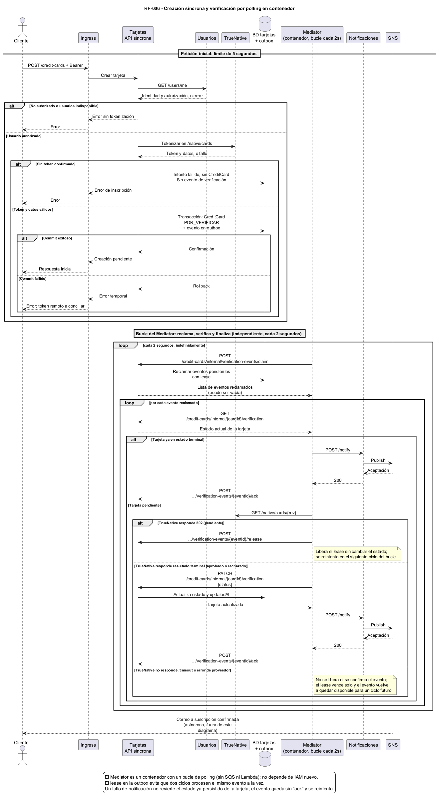

# RF-006 - Crear tarjetas de crédito

[← Inicio](../README.md) · [Componentes](#vista-funcional-y-componentes) · [Despliegue](#vista-de-despliegue-y-operación) · [Patrones](../patrones-solucion.md#rf-006---crear-tarjetas-de-crédito)

## Tabla de contenido

- [Alcance y decisiones](#alcance-y-decisiones)
- [Criterios de aceptación](#criterios-de-aceptación)
- [Contrato y datos](#contrato-y-datos)
  - [Acceso público](#acceso-público)
  - [Entidad persistida](#entidad-persistida)
- [Modelo de secuencia](#modelo-de-secuencia)
- [Proceso paso a paso](#proceso-paso-a-paso)
- [Polling y recuperación](#polling-y-recuperación)
  - [Decisión del mecanismo event-driven (#237)](#decisión-del-mecanismo-event-driven-237)
- [Notificación por correo](#notificación-por-correo)
- [Excepciones](#excepciones)
- [Verificación del diseño](#verificación-del-diseño)
- [Contratos pendientes](#contratos-pendientes)
- [Vista funcional y componentes](#vista-funcional-y-componentes)
  - [Componentes reutilizados](#componentes-reutilizados)
  - [Documentación de componentes nuevos](#documentación-de-componentes-nuevos)
  - [Contratos internos y propiedad](#contratos-internos-y-propiedad)
  - [Estructura de desarrollo](#estructura-de-desarrollo)
- [Vista de despliegue y operación](#vista-de-despliegue-y-operación)
  - [Asignación a infraestructura](#asignación-a-infraestructura)
  - [Seguridad y escalabilidad](#seguridad-y-escalabilidad)
  - [Configuración declarativa](#configuración-declarativa)
  - [Preparación y despliegue](#preparación-y-despliegue)
  - [Operación y observabilidad](#operación-y-observabilidad)
  - [Publicación de documentación](#publicación-de-documentación)

## Alcance y decisiones

Como usuario deseo almacenar mis tarjetas de crédito en la plataforma para realizar pagos de servicios posteriormente. Esta página documenta el diseño de la tarea de arquitectura RF-006, número 233; no afirma que el flujo ya esté implementado ni desplegado.

Se elige **Mediator**, con un coordinador externo que decide los pasos de verificación y notificación. Es una **orquestación dirigida por eventos**, no una coreografía pura de servicios que reaccionan independientemente. Aunque la tarea usa el término «coreografía», la decisión adoptada es explícitamente Mediator. La cola transporta eventos y comandos; el mediador conserva el control del flujo.

La petición inicial es síncrona. El polling y la entrega de correo se ejecutan después, en componentes separados. `credit_cards_app` no ejecuta `asyncio`, hilos, procesos auxiliares ni tareas en segundo plano. Una respuesta de creación confirma almacenamiento en `POR_VERIFICAR`, no aprobación ni entrega del correo.

`credit_cards_app` utiliza Flask, Python 3.13, SQLAlchemy, psycopg y HTTPX síncronos. La tarea #244 implementa `GET /credit-cards`, `GET /credit-cards/count`, `GET /credit-cards/ping` y `POST /credit-cards/reset`; la historia #243 implementa la creación síncrona mediante `POST /credit-cards` y TrueNative `/native/cards`. El listado y la creación autentican mediante `GET /users/me` y filtran por propietario en la base exclusiva de tarjetas. La historia #245 implementa el worker de polling en contenedor y el endpoint interno idempotente; la publicación de eventos desde outbox queda como integración posterior. No se reutiliza `orchestrator_app` de RF-003 a RF-005 ni se modifican esos flujos.

## Criterios de aceptación

| Criterio | Decisión y evidencia esperada |
|---|---|
| Tokenizar mediante la plataforma de pagos | Adaptador síncrono invoca TrueNative `/native/cards` antes de persistir la tarjeta. |
| Conservar únicamente información permitida | Últimos cuatro dígitos, franquicia y token; adicionalmente los identificadores, RUV, estado y fechas exigidos por el modelo. Nunca PAN completo ni CVV. |
| Estado inicial | Guardar `POR_VERIFICAR` y un evento pendiente en la misma transacción. |
| Tokenización fallida | No insertar `CreditCard`; responder error y registrar una notificación del intento sin datos sensibles. |
| Resultado de verificación | Rechazo explícito: `RECHAZADA`. Aprobación explícita: `APROBADA`. |
| Fecha de actualización | Cambiar `updatedAt` en la misma transacción que cambia el estado. |
| Correo para cualquier resultado | Aprobación, rechazo o fallo de inscripción generan una notificación durable y reintentable. |
| Respuesta inicial en máximo cinco segundos | No esperar polling ni correo; aplicar un presupuesto total y probarlo bajo carga. |

El criterio narrativo 5 menciona `VERIFICADA`, pero el enum entregado y el modelo existente definen `APROBADA`. Se adopta `APROBADA` como valor persistido y se interpreta «verificada» como descripción del resultado exitoso. Esta equivalencia debe ratificarse contra el contrato evaluado antes de implementar; no se agrega un cuarto estado.

## Contrato y datos

### Acceso público

La implementación expone `POST /credit-cards` en el mismo host del Ingress existente, con `Authorization: Bearer <token>`. El cliente realiza una única petición para crear la tarjeta. La operación consulta `GET /users/me` y toma de esa respuesta la identidad del propietario; no confía en un `userId` enviado por el cliente. `users_app` ya impide emitir y validar tokens de usuarios cuyo estado no sea `VERIFICADO`, mediante `AuthenticateUserUseCase` y `GetCurrentUserUseCase`. Se reutiliza esa validación, sin duplicarla en tarjetas.

El contrato obligatorio de creación recibe `cardNumber` como cadena numérica sin espacios, `cvv`, `expirationDate` en formato `YY/MM` y `cardHolderName`. Define `400` para campos ausentes, vacíos o con formato inválido; `401` para token inválido o vencido; `403` cuando falta token; `409` para tarjeta ya almacenada por el usuario; `412` para tarjeta vencida; y `201` con exactamente `id`, `userId` y `createdAt` ISO al crearla. Los datos completos viajan al adaptador de pagos solo en memoria y por un canal protegido; no se registran cuerpos de solicitudes. El contrato suministrado no fija códigos para fallos de infraestructura durante la creación; la implementación devuelve `503` sin cuerpo en esos casos.

El listado implementado devuelve un arreglo con `id`, `token`, `userId`, `lastFourDigits`, `issuer`, `status`, `createdAt` y `updatedAt`; sin tarjetas devuelve `[]`. La inclusión del token de pagos es una excepción educativa explícita del contrato. El filtro usa exclusivamente la identidad resuelta por usuarios, nunca un propietario indicado en parámetros. Devuelve `403` vacío si falta token y `401` vacío si las credenciales son inválidas o usuarios las rechaza. Como extensión operativa, fallas de usuarios o de base de datos devuelven `503` vacío.

Los endpoints de soporte no requieren autenticación según el contrato: `count` responde `200` con `{"count": número}` global; `ping` responde `200` con texto `pong`; `reset` elimina todas las tarjetas y responde `200` con `{"msg": "Todos los datos fueron eliminados"}`. No eliminan tablas de otros servicios. `reset` todavía no tiene outbox ni registros de operaciones que limpiar: cuando se implementen deben incorporarse a su transacción de limpieza. Las futuras rutas internas de outbox y actualización no se publican en el Ingress.

### Entidad persistida

| Campo | Regla |
|---|---|
| `id` | UUID generado por el servicio. |
| `userId` | Identificador obtenido de la sesión validada; sin relación SQL con la base de usuarios. |
| `lastFourDigits` | Cadena de cuatro dígitos; no almacenar el resto del número. |
| `issuer` | `VISA`, `MASTERCARD`, `AMERICAN EXPRESS`, `DISCOVER`, `DINERS CLUB` o `UNKNOWN`. |
| `token` | Token opaco del proveedor; capacidad de 256 caracteres, como el modelo existente. No truncar una respuesta inválida. |
| `ruv` | Registro único de verificación del tercero cuando TrueNative lo entrega durante la tokenización; puede quedar nulo hasta la verificación posterior. No generarlo localmente ni sustituirlo por `id`. |
| `status` | `POR_VERIFICAR`, `APROBADA` o `RECHAZADA`. |
| `createdAt` | Fecha de creación en UTC, formato de contrato `yyyy-mm-ddTHH:MM:SS`. |
| `updatedAt` | Fecha UTC de la última transición; inicialmente igual a `createdAt`. |

La base lógica de tarjetas y sus credenciales pertenecen exclusivamente a `credit_cards_app`. Puede alojarse en la instancia RDS compartida, sin compartir permisos sobre tablas de otros servicios. El mediador accede mediante API, nunca por SQL. La outbox y el registro de operaciones son datos técnicos de este mismo servicio; no almacenan PAN, CVV ni credenciales de usuario. El correo del destinatario es un dato de contacto con acceso y retención limitados, no un nuevo atributo de `CreditCard`.

Transiciones admitidas: `POR_VERIFICAR → APROBADA` y `POR_VERIFICAR → RECHAZADA`. Un error de transporte no demuestra rechazo. Una operación repetida con el mismo resultado no altera `updatedAt` ni genera otro evento de negocio. Resultados terminales contradictorios se registran para conciliación, sin sobrescribir el primero automáticamente.

## Modelo de secuencia



[Fuente PlantUML](../diagrams/rf006-sequence.puml). Los métodos internos y la consulta de estado representan contratos propuestos, no endpoints implementados.

## Proceso paso a paso

1. El cliente envía la creación al host único. El Ingress dirige `/credit-cards` al servicio de tarjetas.
2. Tarjetas valida la entrada y consulta `users_app`. Si el usuario no está autenticado o verificado, termina antes de enviar datos a TrueNative.
3. El adaptador de pagos solicita tokenización a `/native/cards` con tiempo de espera acotado. El payload, autenticación y campos de respuesta ya están confirmados contra el contrato oficial del proveedor (objeto `card` anidado con `cardHolderName`, `transactionIdentifier` a nivel raíz, respuesta `201` con `RUV`/`token`/`issuer`).
4. Con token y datos de verificación válidos, el servicio guarda `CreditCard(POR_VERIFICAR)`, el registro técnico de operación y `CardVerificationRequested` en la outbox, en una única transacción local. Si no se puede tokenizar, solo registra un intento fallido y `CardRegistrationFailed`, sin crear tarjeta.
5. Tras el commit responde al cliente. Presupuesto inicial propuesto: 0,5 s autenticación, 2,5 s proveedor, 0,5 s persistencia y 1 s para validación, red y serialización; objetivo interno 4,5 s, límite total 5 s. Se reduce el tiempo disponible de cada llamada según el plazo restante. Estos son límites de diseño a validar, no mediciones ni garantías del proveedor.
6. El worker del Mediator (un contenedor con un bucle propio, sin Lambda ni EventBridge) reclama por HTTP, cada ~2 segundos, los eventos pendientes de la outbox (`POST /credit-cards/internal/verification-events/claim`), que le otorga un lease por evento. No accede a la base de tarjetas directamente.
7. Por cada evento reclamado, el mediador recupera por API restringida el RUV y estado actuales (`GET /credit-cards/internal/{cardId}/verification`) y, si sigue `POR_VERIFICAR`, consulta `GET /native/cards/{ruv}` en TrueNative.
8. Si el proveedor sigue pendiente (`202`), el worker libera explícitamente el lease (`POST /credit-cards/internal/verification-events/{eventId}/release`); el evento queda disponible de inmediato y se vuelve a reclamar en el siguiente ciclo del bucle, ~2 segundos después.
9. Si hay resultado terminal, el mediador solicita actualizar la tarjeta (`PATCH` a la misma ruta interna). Tarjetas valida la transición y la idempotencia, y actualiza estado y `updatedAt`.
10. El mediador consulta `GET /users/{userId}` y llama `POST /notify` de `notifications_app`. Este publica en SNS y devuelve aceptación. Solo entonces el mediador confirma el evento (`POST /credit-cards/internal/verification-events/{eventId}/ack`), liberándolo definitivamente. SNS entrega el correo a una suscripción confirmada del destinatario correspondiente.

## Polling y recuperación

La historia #237 fija el polling mediante `GET /native/cards/{ruv}`. El Mediator obtiene el RUV por la API interna de tarjetas y consulta TrueNative fuera de la petición inicial. La historia #245 implementa este componente como un worker en contenedor con loop propio (ver revisión post-implementación más abajo). El contrato del proveedor admite `202` como estado pendiente y resultados terminales aprobados o rechazados. No se supone que exista un webhook de tarjetas ni se reutiliza el webhook de identidad.

### Decisión del mecanismo event-driven (#237, #245)

**Revisión post-implementación:** el diseño original elegía SQS Standard como disparador. Al desplegar contra AWS Academy se confirmó que los pods de EKS corren con `LabEksNodeRole`, sin permisos SQS, y Academy bloquea agregarle políticas. Por eso se descartaron SQS y Lambda. La solución elegida es **polling HTTP en un worker contenedorizado**, desplegado como `Deployment` junto al resto de aplicaciones. El worker reclama eventos mediante `claim`, consulta TrueNative, finaliza la tarjeta, notifica y confirma mediante `ack`. Repite el ciclo cada aproximadamente dos segundos, sin depender de permisos AWS ni de intervalos mínimos de EventBridge.

| Alternativa | Evaluación para este proyecto | Decisión |
|---|---|---|
| Lambda programada (una programación por tarjeta/intento) | Requiere una función, un execution role y permisos para llamar la API de tarjetas, TrueNative y CloudWatch. Una programación por tarjeta o por intento añade creación, cancelación, duplicados y conciliación de schedules. | No elegida. |
| EventBridge Scheduler (`aws_scheduler_schedule`) → Lambda | Resuelve el disparo temporal y tiene reintentos, pero el propio servicio Scheduler requiere un execution role para invocar la Lambda — un rol IAM nuevo, no disponible en Academy Learner Lab. | No elegida. |
| SQS Standard → Lambda | Usa mensajería estándar, entrega al menos una vez, permite visibilidad, redrive y DLQ. Pero requiere que **quien publica** (`credit_cards_app`, corriendo con `LabEksNodeRole`) tenga permisos `sqs:SendMessage`, y Academy bloquea agregarle esos permisos. Confirmado en producción: el publish falla siempre (`ClientError`), la cola nunca recibe mensajes. | Descartada tras implementación. |
| Regla clásica de EventBridge (`aws_cloudwatch_event_rule`, `schedule_expression`) → Lambda con polling HTTP | La Lambda invoca `GET /native/cards/{ruv}` disparada por tiempo, pero `rate()` tiene un mínimo de 1 minuto, demasiado lento frente a las pruebas de la entrega. | Descartada: cumple restricciones pero no el tiempo de respuesta esperado. |
| Contenedor con loop propio (sin Lambda) | Mismo mecanismo de pull por HTTP sobre el outbox (`claim`/`ack`), pero como proceso de fondo dentro de un `Deployment` normal, sin ningún límite externo de frecuencia — reclama cada ~2 segundos de forma indefinida. No necesita ningún permiso de AWS (solo HTTP saliente por DNS de clúster, igual que `identity_webhook_app`). | **Elegida.** |

Cada reclamo reserva un solo evento durante 60 segundos para proteger el procesamiento y permitir recuperación tras una caída. El intervalo de polling se administra por separado: ante `202`, el worker llama a `POST /credit-cards/internal/verification-events/{eventId}/release` con Bearer de servicio y `leaseId`. La API acepta únicamente una reserva vigente del evento pendiente, la libera y lo deja disponible un segundo después. El worker lo recoge en su siguiente ciclo, aproximadamente cada dos segundos más el tiempo de procesamiento. Si falla la liberación o el proceso cae, el evento se recupera al vencer los 60 segundos. Un evento puede procesarse más de una vez si el `ack` falla después de un `POST /notify` exitoso (entrega al menos una vez); el mediador consulta el estado persistido antes de aplicar una transición.

Los leases expiran para permitir recuperación por otra réplica. El worker repite la consulta ante errores transitorios; la tokenización no se reintenta automáticamente si el proveedor no garantiza idempotencia.

Un horizonte agotado deja la tarjeta en `POR_VERIFICAR`, abre una incidencia operativa y emite aviso de demora, sin fabricar un rechazo. Un proceso de conciliación externo puede reanudar la operación de manera controlada. Un fallo técnico repetido no tiene escalamiento automático todavía: el evento sigue disponible para reintentarse en ciclos futuros del worker; una alerta y una cola de errores dedicada quedan como trabajo pendiente.

El evento de outbox contiene `eventId`, `cardId`, `ruv`, `attempt` y `leaseId`. No transporta PAN, CVV, token de pagos, Bearer de usuario ni correo. El lease y el `eventId` permiten entrega al menos una vez con efectos idempotentes.

## Notificación por correo

### Integración implementada en el Mediator

El worker consulta primero `GET /credit-cards/internal/{cardId}/verification`
con Bearer de servicio. Obtiene `userId`, RUV, estado, últimos cuatro dígitos y
franquicia, sin token de pagos. Si la tarjeta sigue pendiente, consulta TrueNative
y aplica el PATCH de finalización. Si ya es terminal, salta esas dos operaciones.

Después consulta `GET /users/{userId}` para obtener el correo y nombre y ejecuta
`POST /notify` con `CREDIT_CARD_VERIFICATION`. Traduce `APROBADA` a
`VERIFICADA` exclusivamente en la notificación; conserva `RECHAZADA`.
Un fallo de usuarios o notificaciones deja el evento sin `ack` y es reintentable,
sin revertir el estado de la tarjeta. El siguiente intento recupera el estado
guardado y reintenta solo el correo. No se ha implementado deduplicación durable
de notificaciones: respuestas perdidas o entregas duplicadas pueden repetirlas.

La outbox, los leases y las confirmaciones mediante `ack` forman parte del
worker actual. El evento conserva solo identificadores y datos de reintento;
correo, PAN, CVV y token de pagos no se publican en ninguna cola.

El worker usa los Services internos de Kubernetes mediante DNS (`users-app-service`,
`credit-cards-app-service`, `true-native-service` y `notifications-app-service`).
No necesita VPC, SQS ni permisos AWS adicionales. El flujo de identidad mantiene
su política best-effort.

Se conserva la responsabilidad implementada en `notifications_app`: recibir `POST /notify` y publicar en SNS. El webhook de identidad ya usa esta ruta, y su esquema también acepta `CREDIT_CARD_VERIFICATION`. Para RF-006 el payload actual usa `type: CREDIT_CARD_VERIFICATION`, `userId`, `email`, `fullName`, `status`, `ruv`, `lastFourDigits` y `franchise`; no se debe enviar `CARD_REGISTRATION`, `result`, `issuer` ni el token de pagos. La API actual exige `ruv` y `email`, por lo que los casos de fallo sin esos datos requieren ampliar el contrato antes de prometer correo para todos los resultados.

| Resultado | Contenido del correo |
|---|---|
| Aprobada | Inscripción aprobada, últimos cuatro dígitos, franquicia y RUV real. |
| Rechazada | Inscripción rechazada, datos básicos persistidos y RUV real. |
| Fallo de tokenización | No se almacenó una tarjeta; motivo sanitizado y RUV únicamente si TrueNative lo entregó. |
| Demora operativa | Verificación aún pendiente; no presentarla como rechazo ni como resultado definitivo. |

La obligación de incluir datos almacenados y RUV no puede satisfacerse literalmente cuando no hubo tarjeta ni RUV. Ese caso se documenta como «no disponible» y debe acordarse con el evaluador. Las solicitudes no autenticadas no originan correos porque no existe un propietario validado.

SNS acepta publicaciones, pero su aceptación no prueba recepción en el buzón. Si `POST /notify` falla, el evento permanece reintentable; no se revierte una tarjeta aprobada. Un fallo después de publicar en SNS y antes de confirmar puede duplicar el correo: se mantiene `eventId` estable para trazabilidad y deduplicación cuando el servicio de notificaciones la implemente, sin prometer entrega exactamente una vez.

En Academy se utiliza `EMAIL_TO_NOTIFY` y la suscripción SNS confirmada para evaluación. **Un tema compartido sin filtros envía el mismo mensaje a todos sus suscriptores**, por lo que no sirve para enviar información privada a propietarios distintos. El diseño multiusuario requiere suscripciones confirmadas filtradas por destinatario o temas aislados y permisos acotados; `notifications_app` debe publicar con el atributo de destinatario correcto. La dirección de evaluación solo es un destino de prueba y no reemplaza la regla de notificar al dueño. Mientras no se resuelva el alta/confirmación de cada destinatario, no se puede declarar completo el criterio para usuarios arbitrarios.

## Excepciones

| Situación | Acción y recuperación |
|---|---|
| Entrada inválida o usuario no autorizado | Rechazar antes de tokenizar; no almacenar tarjeta ni iniciar polling. |
| `users_app` no disponible | Error temporal dentro del presupuesto; no asumir identidad ni autorización. |
| Tokenización rechazada | No crear tarjeta; guardar evento de fallo con datos mínimos y responder error. |
| Timeout al tokenizar | Resultado remoto incierto: no crear tarjeta sin token confirmado ni repetir ciegamente la escritura; conciliar si el proveedor ofrece una clave de consulta. |
| Token obtenido, commit fallido | Rollback de tarjeta y outbox; responder error. Puede quedar un token remoto huérfano; no se inventa una API de revocación. Registrar incidencia sanitizada y acordar conciliación con el proveedor. |
| Base de datos indisponible al guardar un fallo | No se puede prometer una notificación durable; emitir alerta operativa. Recuperar el intento desde un registro seguro disponible, si existe, y declarar la limitación. |
| El worker no está disponible o no alcanza a `credit_cards_app` | La outbox retiene el evento sin reclamar; se procesa en un ciclo posterior cuando el worker esté disponible. La respuesta de creación no depende del worker. |
| Polling pendiente, timeout, `429` o error transitorio | Reprogramar con espera acotada, respetando `Retry-After` cuando exista; mantener `POR_VERIFICAR`. |
| Credenciales del proveedor inválidas o contrato inesperado | Alertar, limitar reintentos y pasar a recuperación; no convertirlo en rechazo de negocio. |
| Mensaje repetido o consumidor cae | Recuperar tras expiración de lease; comprobar `eventId`, versión y estado antes de aplicar efectos. |
| Resultado tardío contradictorio | No cambiar automáticamente un estado terminal; conciliación con trazabilidad. |
| Notificaciones/SNS indisponibles | Reintentar correo independientemente de la verificación; el evento no se confirma (`ack`) y se reintenta en un ciclo posterior del worker, sin alerta automática todavía. |

## Verificación del diseño

| Prueba prevista | Resultado esperado |
|---|---|
| Creación exitosa con proveedor pendiente | Una petición; respuesta antes de 5 s; tarjeta `POR_VERIFICAR` y evento durable. |
| Proveedor no entrega token | Cero tarjetas nuevas; error y notificación de fallo pendiente. |
| Aprobación y rechazo | Estado terminal correcto, `updatedAt` actualizado y correo con RUV real. |
| Duplicación/reordenamiento de mensajes | Sin doble transición ni regresión; duplicados de correo identificables por `eventId`. |
| Caída entre commit y publicación | La outbox recupera el trabajo sin intervención del cliente. |
| Caída entre publicación y confirmación | Mensaje repetido tolerado; no se pierde el evento. |
| Caída entre actualización y confirmación (`ack`) | El reintento reconoce el resultado ya aplicado (idempotente). |
| Dos réplicas procesan la misma tarjeta | Solo el lease vigente aplica la transición. |
| Timeout, `429` y recuperación | No hay rechazo falso; el evento se reintenta en un ciclo posterior del worker, sin alerta automática todavía. |
| Privacidad y aislamiento | Ausencia de PAN/CVV/token en logs y correos; ningún servicio accede a tablas ajenas. |
| Propietarios distintos | Cada correo llega solo al destinatario autorizado. |
| Usuario no verificado | No puede emitir ni validar token; no se inicia el registro de tarjeta. |
| Carga creciente | Medir latencia de creación, antigüedad de outbox y tasa de polling, respetando cuotas TrueNative. |

Estas pruebas son criterios para la implementación futura, no resultados ejecutados en esta tarea documental.

## Contratos pendientes

El contrato público de tarjetas ya está incorporado en esta página y guía la implementación de #243 y #244. La historia #237 fija la consulta de estado en `GET /native/cards/{ruv}` y la #245 implementa el worker consumidor en contenedor. El contrato de `POST /native/cards` y `GET /native/cards/{ruv}` de TrueNative ya está confirmado contra la guía oficial del proveedor y coincide con lo implementado en `payment_provider_adapter.py` y `handler.py`. El adaptador acepta los nombres de estado aprobados/rechazados usados por TrueNative y libera el lease (`release`) para las respuestas no terminales o no confiables, en vez de dejarlas en una cola. El modelo permite `ruv` nulo durante la tokenización: si el proveedor lo entrega únicamente al terminar la verificación, el mediador deberá completarlo mediante la API interna; no usar una cadena ficticia.

También deben cerrarse el payload de `CREDIT_CARD_VERIFICATION`, el destino por propietario, la recuperación de correos, los permisos efectivos de LabRole y la equivalencia `VERIFICADA/APROBADA`. Estos puntos no se presentan como capacidades ya disponibles. El [plan de despliegue](#vista-de-despliegue-y-operación) distingue los archivos existentes de los que deben crearse.

## Vista funcional y componentes

### Componentes reutilizados

| Componente | Responsabilidad en RF-006 | Estado |
|---|---|---|
| Ingress NGINX y balanceador | Mismo host; ruta pública `/credit-cards` hacia tarjetas. No exponer operaciones internas. | Ruta declarada en `k8s/aws/ingress.yml`; `credit-cards-app-service` y su backend están definidos en `k8s/aws/credit_cards_app.yml`. |
| `users_app` | Resolver `GET /users/me`; impedir emisión y validación de tokens para usuarios no verificados. | Validación implementada en ambos casos de uso; existen pruebas para `POR_VERIFICAR` y `NO_VERIFICADO`. |
| TrueNative | Tokenizar y permitir consultar el resultado de verificación mediante `GET /native/cards/{ruv}`. | Manifiesto existente para `true-native-service`; contrato de solicitud/respuesta confirmado contra la guía oficial del proveedor. |
| `identity_webhook_app` | Atiende verificación de identidad, fuera del flujo de tarjetas. Comparte el contrato de notificaciones. | Existe; no utilizar su callback como mecanismo de verificación de tarjetas. |
| `orchestrator_app`, publicaciones, rutas, ofertas y scores | Mantener RF-003 a RF-005 operativos. | No participan en RF-006 ni se modifican para implementarlo. |

### Documentación de componentes nuevos

#### Credit Cards App

| Campo | Descripción |
|---|---|
| **Componente** | Credit Cards App |
| **Código/Id del componente** | `credit_cards_app` |
| **Tipo** | Microservicio HTTP síncrono, propietario de datos. |
| **Responsabilidad** | Autorizar, tokenizar y persistir la tarjeta; exponer listado y operaciones de soporte; aplicar el estado inicial `POR_VERIFICAR`. La coordinación de verificación queda fuera de la petición síncrona. |
| **Consideraciones de diseño** | Estructura Flask/Python 3.13 existente; SQLAlchemy y psycopg síncronos. No incorporar `asyncio`, hilos, procesos auxiliares ni tareas de fondo. Tarjeta y evento comparten transacción local. El coste es ampliar el modelo técnico para outbox, leases y deduplicación. API replicable, con estado en PostgreSQL. |
| **Integraciones** | Ingress; API de usuarios por HTTP; TrueNative mediante adaptador síncrono; base propia por PostgreSQL; API interna consumida por el mediador. |

#### Credit Cards Mediator

| Campo | Descripción |
|---|---|
| **Componente** | Credit Cards Mediator |
| **Código/Id del componente** | `credit_cards_mediator_app` |
| **Tipo** | Contenedor worker con loop propio (sin Service/Ingress, no atiende peticiones). |
| **Responsabilidad** | Reclamar eventos pendientes del outbox de tarjetas por HTTP, consultar el estado en TrueNative y solicitar transiciones terminales a tarjetas. La notificación se encadena después del resultado. |
| **Consideraciones de diseño** | No inicia tareas dentro de `credit_cards_app`; la tarea de fondo vive en este componente separado. No accede directamente a SQL. Sin AWS SDK ni IAM propio (Academy Learner Lab bloquea `iam:AttachRolePolicy`/`iam:CreateRole` por completo, verificado en vivo). El lease del outbox (`claim`/`ack`) entrega al menos una vez; el endpoint interno idempotente y `eventId` previenen efectos inconsistentes. |
| **Integraciones** | API interna de tarjetas (`claim`/`ack`/verification) por DNS de clúster; TrueNative para consultar estado; `notifications_app` mediante `POST /notify`. |

#### Notifications App

| Campo | Descripción |
|---|---|
| **Componente** | Notifications App |
| **Código/Id del componente** | `notifications_app` |
| **Tipo** | Servicio HTTP interno de publicación de notificaciones. |
| **Responsabilidad** | Validar el contrato `POST /notify`, construir el mensaje sin datos sensibles y publicar en SNS. El contrato vigente acepta `CREDIT_CARD_VERIFICATION` con `lastFourDigits` y `franchise`. |
| **Consideraciones de diseño** | Conserva `IDENTITY_VERIFICATION` y acepta `CREDIT_CARD_VERIFICATION`. No controla polling ni estado de tarjetas. Solo confirmar aceptación tras respuesta exitosa de SNS. El mediador mantiene reintentos durables; una publicación SNS repetida puede producir correo repetido. No asumir persistencia o deduplicación aún inexistente. |
| **Integraciones** | Mediador de tarjetas, webhook de identidad y SNS. Service previsto: `notifications-app-service`. |

#### Canal de correo

| Campo | Descripción |
|---|---|
| **Componente** | Canal de correo SNS |
| **Código/Id del componente** | Tema y suscripciones SNS de notificaciones (propuestos) |
| **Tipo** | Servicio serverless de publicación/suscripción. |
| **Responsabilidad** | Distribuir el correo a suscripciones confirmadas y autorizadas. |
| **Consideraciones de diseño** | Confirmación manual del correo Academy antes de evaluar. En multiusuario se requieren filtros por destinatario o temas aislados; no publicar información privada a todos los suscriptores de un tema compartido. La aceptación SNS no es comprobante de entrega al buzón. |
| **Integraciones** | `notifications_app`, destinatarios confirmados y configuración Terraform. |

### Contratos internos y propiedad

Las siguientes son operaciones lógicas a implementar; sus nombres no afirman que existan rutas HTTP concretas. Deben protegerse con autenticación de servicio y permisos por operación, además de aislamiento de red. Estar en un Service `ClusterIP` no sustituye autenticación.

| Operación | Propietario | Semántica |
|---|---|---|
| Reclamar outbox vencida | Tarjetas | Reservar lote con lease y devolver solo eventos comprometidos y con `nextAttemptAt` vencido. |
| Confirmar publicación | Tarjetas | Marcar enviado (`ack`) únicamente después de una notificación exitosa; usar `eventId` estable. |
| Reclamar intento | Tarjetas | Asignar lease de operación de forma atómica, comprobar versión/estado y devolver datos de polling al mediador autorizado. |
| Reprogramar intento | Tarjetas | Aplicar una sola vez cada `eventId`; persistir próximo intento y outbox en una transacción. |
| Finalizar verificación | Tarjetas | `PATCH /credit-cards/internal/{cardId}/verification`, protegido por token de servicio. Actualización condicional de estado y fecha; resultados terminales no retroceden. |
| Consultar datos de notificación | Tarjetas | Obtener destinatario del usuario validado y datos básicos persistidos, incluido RUV si existe. |
| Confirmar publicación de correo | Tarjetas | Registrar aceptación del publicador; no confundir con entrega efectiva. |
| `POST /notify` | Notificaciones | Aceptar solicitud autenticada, publicar en SNS o devolver error reintentable. |

No existe transacción distribuida entre PostgreSQL, TrueNative y SNS. La consistencia se obtiene con transacciones locales, outbox y reintentos idempotentes. El mediador decide el flujo; tarjetas conserva autoridad sobre sus invariantes y datos. Un fallo de correo nunca revierte una aprobación.

### Estructura de desarrollo

Tarjetas separa dominio, puertos, adaptadores de base de datos y entrada HTTP. Existen los casos de uso síncronos de listado, conteo, limpieza y creación, además del endpoint interno de finalización. El worker tiene su propio paquete y pruebas; no importa modelos ni módulos Python de otras aplicaciones.

| Ubicación | Situación y trabajo previsto |
|---|---|
| `credit_cards_app/` | Listado, soporte, creación síncrona con TrueNative y finalización interna idempotente implementados en #243/#244/#245. |
| `credit_cards_mediator_app/` | Worker en contenedor implementado; consulta TrueNative, libera y reprograma los `202` mediante `release` y finaliza estados terminales antes de notificar y confirmar con `ack`. |
| `notifications_app/` | Aplicación implementada y desplegable; acepta identidad y tarjetas, publica en SNS. |
| `k8s/aws/` | Manifiesto de tarjetas incorpora el secreto del endpoint interno; `credit_cards_mediator_app.yml` despliega el worker sin Service ni Ingress. |
| `terraform/stacks/apps/` | Sin infraestructura AWS adicional para el mediador (es un contenedor más, como cualquier otra app); no se crean roles IAM nuevos. |
| `docs/requerimientos/rf-006.md` | Diseño navegable, componentes, despliegue y operación. |
| `docs/diagrams/rf006-sequence.puml` y `.png` | Modelo de secuencia del diseño. |

El worker se despliega automáticamente junto al resto de las apps, sin ningún paso manual ni execution role adicional. Esta documentación no introduce comentarios en código.

## Vista de despliegue y operación

### Asignación a infraestructura

| Elemento | Despliegue y responsabilidad |
|---|---|
| Punto de entrada | Balanceador e Ingress NGINX existentes; mismo host, ruta `/credit-cards`. Mantener rutas anteriores. |
| Tarjetas | Deployment EKS, Service `credit-cards-app-service` propuesto, puerto interno 30006, acceso por Service 80. Persistencia síncrona. |
| Usuarios | Service existente `users-app-service`; autenticación y estado verificado. |
| Mediador | Deployment EKS sin Service ni Ingress (no atiende peticiones); loop propio por DNS de clúster hacia TrueNative, `credit_cards_app`, `users_app` y `notifications_app`. |
| TrueNative | Deployment existente y `true-native-service` interno; validar puerto y contrato contra el manifiesto instalado. |
| Base de tarjetas | Base lógica y rol exclusivo en PostgreSQL/RDS. Solo tarjetas accede; tarjetas, outbox y operaciones comparten transacción local. |
| Notificaciones | Deployment y Service `notifications-app-service`, HTTP interno `POST /notify`; aplicación ya incorporada al `config.yaml`. |
| Correo | Tema SNS, suscripciones confirmadas y selección segura por destinatario. SNS es serverless. |
| Imágenes y secretos | ECR para imágenes; mecanismos existentes de Secrets Manager y Secrets Kubernetes para configuración sensible. |

Toda infraestructura AWS se ubica en `us-east-1`. Los nuevos recursos de aplicación de Kubernetes utilizan el namespace `default`; no se crean namespaces adicionales. Se respeta la infraestructura existente del controlador Ingress.

### Seguridad y escalabilidad

Usar el LabRole existente y verificar sus permisos efectivos para SNS, ECR y secretos; no crear roles IAM ni asumir que todas las acciones están permitidas. La forma de obtener credenciales para los pods debe acordarse con los mecanismos permitidos en Academy. No copiar credenciales temporales a imágenes, código o documentación. Si falta un permiso, constituye un bloqueo de despliegue que debe resolverse antes de afirmar que la solución funciona.

El diseño exige que el Ingress exponga solo operaciones públicas de tarjetas. La regla actual utiliza `pathType: Prefix` para `/credit-cards`, por lo que también enrutaría futuras operaciones internas colocadas bajo ese prefijo. Deben ubicarse fuera del prefijo público o restringirse explícitamente antes de desplegarlas, además de exigir credenciales de servicio y autorización propia. Proteger transporte, secretos y token de pagos; restringir las conexiones de PostgreSQL mediante rol y red. Las políticas de red propuestas deben verificarse contra el soporte efectivo del clúster: no se presupone que los manifiestos actuales ya las implementen.

Las réplicas del API escalan por CPU y latencia; el worker del Mediator escala por antigüedad de la outbox, con límite de concurrencia según cuota de TrueNative. El lease de cada evento evita que varias réplicas del worker reclamen la misma outbox al mismo tiempo. Estas son políticas a implementar y medir. El estado durable permite reiniciar pods, pero no garantiza disponibilidad si RDS o los servicios dependientes están caídos.

### Configuración declarativa

El `config.yaml` actual ya contiene la estructura requerida: `team`, `board`, `docs`, `tf_stacks`, `default_env`, `k8s_manifests` y `apps`. Declara stacks `database` y `apps`, ambiente `student1` y manifiestos `k8s/aws`. Por cada stack deben mantenerse las carpetas de stack y de ambiente con `backend.tfvars` y `terraform.tfvars`.

Se conserva esa configuración operativa: registrar aplicaciones o stacks incompletos haría que el pipeline intentara desplegar una solución todavía inexistente. `credit_cards_app` ya está registrado porque tiene Dockerfile, pruebas y manifiesto AWS. Implementa listado, soporte, creación síncrona y el endpoint interno de finalización (#243/#244/#245). El mediador (#237/#245) está implementado como worker contenedorizado con Dockerfile, pruebas y Deployment Kubernetes.

| Entrada | Estado o condición |
|---|---|
| `apps: credit_cards_app` | Registrada: API funcional para #243/#244/#245, Dockerfile, pruebas, ECR y manifiesto AWS coherentes. |
| `apps: credit_cards_mediator_app` | Registrada: worker contenedorizado con Dockerfile, pruebas y Deployment Kubernetes; no expone Service ni ruta en Ingress. |
| `apps: notifications_app` | Registrada e implementada para `IDENTITY_VERIFICATION` y `CREDIT_CARD_VERIFICATION`; confirmar SNS antes de evaluar. |
| `image_tag` y `authors` | Usar tag consistente en configuración/manifiestos y autores reales asignados; no inventar integrantes responsables. |
| `tf_stacks` | Conservar `database` antes de `apps`; incorporar SNS en el stack correspondiente sin dependencia circular. |
| Nuevo stack, si se decide separarlo | Crear previamente `terraform/stacks/<nombre>/` y `terraform/environments/<ambiente>/<nombre>/` para cada ambiente utilizado, con ambos archivos tfvars. |
| `post_k8s_stacks` | No se usa: el worker se despliega junto con los manifiestos de `k8s/aws` y usa DNS interno del clúster. |

No se modifican los workflows protegidos de despliegue, destrucción ni evaluación para agregar aplicaciones. El worker se despliega mediante `k8s/aws/credit_cards_mediator_app.yml` y usa las URLs internas de Kubernetes definidas en el manifiesto. No requiere Lambda, SQS, roles IAM adicionales ni pasos `post_k8s_stacks`.

### Preparación y despliegue

1. Cerrar los [contratos pendientes](#contratos-pendientes), completar componentes y validar unitarias, contratos, aislamiento e idempotencia. La cobertura exigida se mide en el pipeline; objetivo mínimo 70 %, sin afirmar cobertura de código aún no escrito.
2. Crear migraciones propias de tarjetas/outbox/operaciones; configurar base y usuario exclusivos. Crear tema y suscripciones de SNS con Terraform. Verificar permisos LabRole y credenciales de la sesión Academy.
3. Crear manifiestos de los nuevos Deployments y Services en `k8s/aws` y los secretos requeridos. Conectar el Service de tarjetas con la ruta `/credit-cards` ya declarada en el Ingress. Incorporar aplicaciones a `config.yaml` solamente cuando existan sus artefactos. No exponer rutas internas mediante la regla pública de tipo `Prefix`.
4. Definir `EMAIL_TO_NOTIFY` en los secretos de GitHub y reflejarlo en el secreto AWS `secrets-pipeline-native-map` según el mecanismo de la entrega. No versionar direcciones privadas ni valores de credenciales. Configurar ARN de SNS, URLs internas, credenciales de TrueNative y parámetros de polling mediante configuración.
5. Ejecutar el workflow existente `ci_entrega2_deploy.yml` para el ambiente elegido. El diseño no agrega dependencias a Lambdas ni roles nuevos. Revisar pods, salud de servicios y migraciones antes de probar RF-006.
6. Abrir el correo de confirmación SNS en `EMAIL_TO_NOTIFY` y confirmar la suscripción **antes de ejecutar el evaluador**. Verificar que no permanezca `PendingConfirmation` y que el filtro/destino coincida con el usuario de prueba.
7. Ejecutar el evaluador aplicable: en este repositorio existen `ci_entrega3_evaluador.yml` y `ci_entrega3_email_evaluador.yml`; este último recibe además el correo de prueba. Verificar respuesta inicial, resultado persistido y correo real, no solo aceptación SNS.
8. Al terminar la evaluación, ejecutar `ci_entrega2_destroy.yml` siguiendo las reglas del entorno. Antes de destruir, conservar la evidencia necesaria de pruebas; la destrucción elimina infraestructura y puede perder trabajo pendiente.

Los pasos describen el despliegue futuro; no se ejecutaron como parte de la creación de documentación.

### Operación y observabilidad

| Señal | Uso operativo |
|---|---|
| Latencia inicial y errores del API | Comprobar límite de cinco segundos bajo carga y disponibilidad de dependencias. |
| Eventos no reclamados y antigüedad de la outbox | Detectar caída del worker del Mediator. |
| Ciclos del worker y eventos procesados por ciclo | Ajustar réplicas respetando límites de TrueNative. |
| `429`, timeouts y duración de verificación | Ajustar intervalos, identificar cuota agotada o proveedor caído. |
| Leases vencidos e intentos recuperados | Detectar workers inestables y verificar recuperación. |
| Tarjetas pendientes fuera del horizonte | Alertar y conciliar, sin rechazo automático. |
| Fallos de `POST /notify` y SNS | Reintentar correo sin repetir tokenización ni transiciones. |
| Suscripción sin confirmar o destino incorrecto | Bloquear declaración de éxito de notificación; corregir configuración. |

Correlacionar mediante `operationId`, `cardId` y `eventId`. No registrar PAN, CVV, token de pagos, encabezado de autorización o payload completo del proveedor. Limitar retención y acceso a registros técnicos y datos de contacto. Para reprocesar un evento con fallo persistente, revisar la causa, corregirla y dejar que el worker lo vuelva a reclamar en un ciclo posterior, conservando los identificadores; no editar manualmente estados finales en la base.

### Publicación de documentación

El índice de `docs/README.md` enlaza RF-006, sus vistas y patrones. Todas las imágenes y fuentes se guardan dentro de `docs/diagrams`, sin servicios externos de renderizado ni enlaces a documentación externa en las páginas nuevas.

Para regenerar imágenes, ejecutar desde la raíz con una instalación local de PlantUML y Java:

```powershell
java -jar "C:\ruta\plantuml.jar" -charset UTF-8 -tpng "docs/diagrams/rf006-*.puml"
```

Los diagramas de componentes y despliegue usan Smetana, incluido en PlantUML. Versionar tanto fuentes como PNG. Después de integrar los cambios en la rama que publica la página existente, publicar mediante el mecanismo configurado de GitHub Pages y comprobar la navegación y carga de imágenes. El enlace del sitio ya está declarado en `config.yaml`; guardar archivos localmente no actualiza por sí solo ese sitio. Esta tarea no ejecuta push ni publicación remota.
