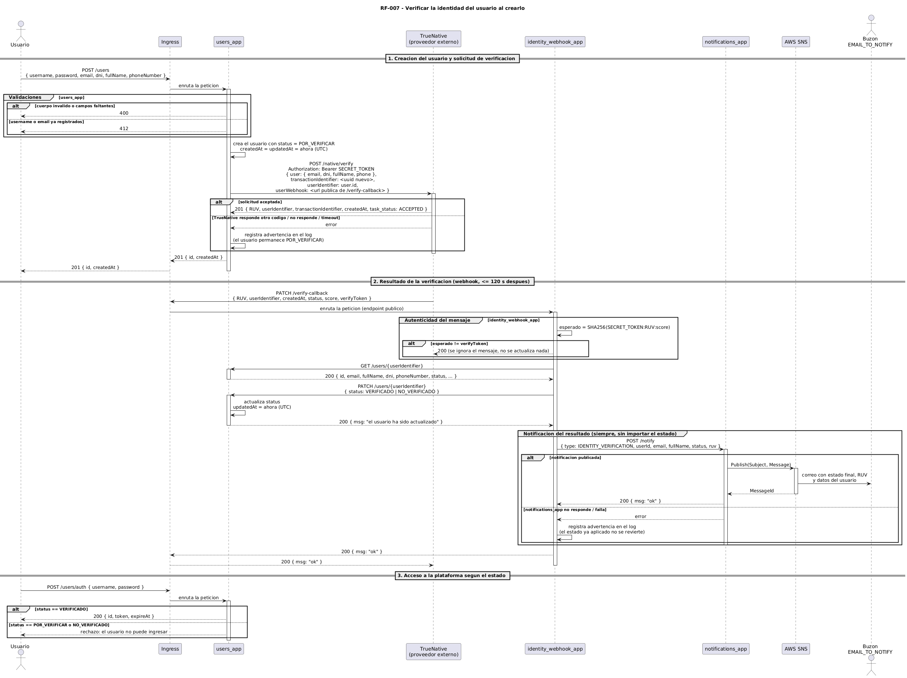

# RF-007 - Verificar la identidad del usuario

[← Volver al inicio](../README.md) · [Página de patrones de solución](../patrones-solucion.md)

## Tabla de contenido

- [RF-007 - Verificar la identidad del usuario](#rf-007---verificar-la-identidad-del-usuario)
  - [Tabla de contenido](#tabla-de-contenido)
  - [Historia y criterios de aceptación](#historia-y-criterios-de-aceptación)
  - [Contratos de los endpoints](#contratos-de-los-endpoints)
    - [C1. Crear usuario](#c1-crear-usuario)
    - [C2. Solicitar verificación a TrueNative](#c2-solicitar-verificación-a-truenative)
    - [C3. Recibir el resultado (webhook)](#c3-recibir-el-resultado-webhook)
    - [C4. Consultar el usuario](#c4-consultar-el-usuario)
    - [C5. Actualizar el estado del usuario](#c5-actualizar-el-estado-del-usuario)
    - [C6. Notificar el resultado](#c6-notificar-el-resultado)
  - [Componentes involucrados](#componentes-involucrados)
  - [Modelo de secuencia](#modelo-de-secuencia)
  - [Explicación paso a paso](#explicación-paso-a-paso)
    - [Flujo principal](#flujo-principal)
    - [Flujos de excepción y manejo de errores](#flujos-de-excepción-y-manejo-de-errores)
  - [Seguridad del webhook](#seguridad-del-webhook)
  - [Consistencia de datos](#consistencia-de-datos)
  - [Ejecución sin tareas asíncronas en users\_app](#ejecución-sin-tareas-asíncronas-en-users_app)
  - [Patrones de solución](#patrones-de-solución)

## Historia y criterios de aceptación

> Como administrador del sistema deseo verificar la identidad de un usuario cuando es creado, de manera que pueda certificar que solo usuarios verificados pueden realizar publicaciones y ofertas en la plataforma.

Criterios de aceptación:

- Cuando el usuario es creado, el usuario se crea con estado `POR_VERIFICAR`.
- Mientras el usuario tenga el estado `POR_VERIFICAR` no podrá acceder al sistema.
- Nuestro sistema se comunica con un proveedor de verificación de identidad para verificar el usuario.
- El proveedor de identidad provee un puntaje de 1 a 100 sobre el análisis de identidad dependiendo de los datos brindados. Un puntaje igual o mayor de 60 indica que el usuario fue verificado, y menor, que no pudo serlo.
- La respuesta del proveedor debe actualizar el estado del usuario; el resultado podría ser `VERIFICADO` o `NO_VERIFICADO`.
- Si el estado del usuario es actualizado, la fecha de actualización del usuario debe ser modificada usando la fecha actual.
- Si el usuario mantiene el estado `NO_VERIFICADO` no podrá ingresar a la plataforma.
- Si el usuario queda en estado `VERIFICADO`, puede acceder a la plataforma para utilizar sus servicios.
- Indiferente del resultado del proceso, el usuario debe ser notificado por correo electrónico. El correo debe contener el estado final del proceso, el RUV generado por el tercero y los datos del usuario con los que se realizó la verificación.

## Contratos de los endpoints

RF-007 no expone un endpoint nuevo para el usuario final. Extiende la creación de usuarios y agrega un webhook público que consume el proveedor. El flujo usa estos seis contratos:

| # | Contrato | Origen → Destino | Visibilidad | Paso del flujo |
|---|---|---|---|---|
| C1 | `POST /users` | Usuario → `users_app` | Pública (Ingress) | Creación del usuario |
| C2 | `POST /native/verify` | `users_app` → TrueNative | Externa (proveedor) | Solicitud de verificación |
| C3 | `PATCH /verify-callback` | TrueNative → `identity_webhook_app` | Pública (Ingress) | Recepción del resultado |
| C4 | `GET /users/{id}` | `identity_webhook_app` → `users_app` | Interna (clúster) | Lectura de los datos del usuario |
| C5 | `PATCH /users/{id}` | `identity_webhook_app` → `users_app` | Interna (clúster) | Actualización del estado |
| C6 | `POST /notify` | `identity_webhook_app` → `notifications_app` | Interna (clúster) | Notificación del resultado |

`POST /users/auth` y `GET /users/me` conservan su contrato. RF-007 solo agrega la regla de que el usuario debe estar `VERIFICADO` para obtener y usar un token.

---

### C1. Crear usuario

| Elemento | Valor |
|---|---|
| Método y ruta | `POST /users` |
| Origen → Destino | Usuario → Ingress → `users_app` |
| Encabezados | `Content-Type: application/json` |

**Solicitud**

```json
{
  "username": "jperez",
  "password": "********",
  "email": "jperez@correo.com",
  "dni": "1020304050",
  "fullName": "Juan Pérez",
  "phoneNumber": "3001234567"
}
```

`dni`, `fullName` y `phoneNumber` son opcionales, pero entre más datos se envíen, mayor es la probabilidad de que la verificación sea exitosa.

**Respuestas**

| Código | Situación | Cuerpo |
|---|---|---|
| `201` | Usuario creado en estado `POR_VERIFICAR` | `{ "id": "<uuid>", "createdAt": "<fecha ISO 8601>" }` |
| `400` | Cuerpo incompleto o con formato inválido | Sin cuerpo |
| `412` | El `username` o el `email` ya están registrados | Sin cuerpo |

---

### C2. Solicitar verificación a TrueNative

| Elemento | Valor |
|---|---|
| Método y ruta | `POST {TRUE_NATIVE_URL}/native/verify` |
| Origen → Destino | `users_app` → TrueNative |
| Encabezados | `Authorization: Bearer <SECRET_TOKEN>` |

**Solicitud**

```json
{
  "user": {
    "email": "jperez@correo.com",
    "dni": "1020304050",
    "fullName": "Juan Pérez",
    "phone": "3001234567"
  },
  "transactionIdentifier": "<uuid nuevo por solicitud>",
  "userIdentifier": "<id del usuario en users_app>",
  "userWebhook": "https://<host>/verify-callback"
}
```

**Respuestas**

| Código | Situación | Cuerpo |
|---|---|---|
| `201` | Solicitud aceptada | `{ "RUV", "userIdentifier", "transactionIdentifier", "createdAt", "task_status": "ACCEPTED" }` |
| `400` | Falta el objeto `user`, un identificador o el webhook | Sin cuerpo |
| `401` | El token secreto no es válido | Sin cuerpo |
| `403` | La solicitud no incluye el token secreto | Sin cuerpo |
| `409` | Ya hay una solicitud en curso para el mismo usuario y transacción | Sin cuerpo |

---

### C3. Recibir el resultado (webhook)

| Elemento | Valor |
|---|---|
| Método y ruta | `PATCH /verify-callback` |
| Origen → Destino | TrueNative → Ingress → `identity_webhook_app` |
| Encabezados | Ninguno de autorización. La autenticidad se valida con `verifyToken` (ver [Seguridad del webhook](#seguridad-del-webhook)). |

**Solicitud**

```json
{
  "RUV": "<registro único de verificación>",
  "userIdentifier": "<id del usuario en users_app>",
  "createdAt": "<fecha ISO 8601>",
  "status": "VERIFICADO",
  "score": 87,
  "verifyToken": "<SHA256(SECRET_TOKEN:RUV:score)>"
}
```

**Respuestas**

| Código | Situación | Cuerpo |
|---|---|---|
| `200` | Resultado aplicado y notificado | `{ "msg": "ok" }` |
| `200` | Firma inválida: el mensaje se descarta sin aplicar cambios | `{ "msg": "ok" }` |
| `422` | Cuerpo con estructura inválida | Detalle de validación |

---

### C4. Consultar el usuario

| Elemento | Valor |
|---|---|
| Método y ruta | `GET /users/{id}` |
| Origen → Destino | `identity_webhook_app` → `users_app` |
| Encabezados | Ninguno |

**Respuestas**

| Código | Situación | Cuerpo |
|---|---|---|
| `200` | Usuario encontrado | `{ "id", "username", "email", "fullName", "dni", "phoneNumber", "status" }` |
| `404` | El usuario no existe | Sin cuerpo |

---

### C5. Actualizar el estado del usuario

| Elemento | Valor |
|---|---|
| Método y ruta | `PATCH /users/{id}` |
| Origen → Destino | `identity_webhook_app` → `users_app` |
| Encabezados | `Content-Type: application/json` |

**Solicitud**

```json
{
  "status": "VERIFICADO"
}
```

`status` admite `VERIFICADO` o `NO_VERIFICADO`. `users_app` asigna la fecha actual a `updatedAt` al aplicar el cambio.

**Respuestas**

| Código | Situación | Cuerpo |
|---|---|---|
| `200` | Estado actualizado | `{ "msg": "el usuario ha sido actualizado" }` |
| `400` | Cuerpo inválido o `status` fuera de los valores permitidos | Sin cuerpo |
| `404` | El usuario no existe | Sin cuerpo |

---

### C6. Notificar el resultado

| Elemento | Valor |
|---|---|
| Método y ruta | `POST /notify` |
| Origen → Destino | `identity_webhook_app` → `notifications_app` → AWS SNS |
| Encabezados | `Content-Type: application/json` |

**Solicitud**

```json
{
  "type": "IDENTITY_VERIFICATION",
  "userId": "<id del usuario>",
  "email": "jperez@correo.com",
  "fullName": "Juan Pérez",
  "status": "VERIFICADO",
  "ruv": "<registro único de verificación>"
}
```

**Respuestas**

| Código | Situación | Cuerpo |
|---|---|---|
| `200` | Notificación publicada en el tópico de SNS | `{ "msg": "ok" }` |
| `422` | Cuerpo con estructura inválida | Detalle de validación |

## Componentes involucrados

| Componente | Rol en RF-007 |
|---|---|
| Ingress | Punto de acceso único. Enruta `/users` hacia `users_app` y el webhook público hacia `identity_webhook_app`. |
| `users_app` | Crea el usuario en `POR_VERIFICAR`, solicita la verificación a TrueNative, expone la lectura (`GET /users/{id}`) y la actualización (`PATCH /users/{id}`) del usuario, y bloquea el acceso de usuarios no verificados. |
| TrueNative | Proveedor externo. Analiza los datos del usuario y publica el resultado en el webhook en un máximo de 120 segundos. |
| `identity_webhook_app` | Componente nuevo. Recibe el webhook, valida su autenticidad, aplica el estado en `users_app` y solicita la notificación. No tiene base de datos. |
| `notifications_app` | Componente nuevo. Arma el correo del resultado y lo publica en un tópico de AWS SNS. |
| AWS SNS | Entrega el correo a la suscripción configurada (`EMAIL_TO_NOTIFY`). |

## Modelo de secuencia



Fuente PlantUML: [`diagrams/rf007-sequence.puml`](../diagrams/rf007-sequence.puml).

## Explicación paso a paso

### Flujo principal

**1. Creación del usuario y solicitud de verificación**

1. El usuario envía `POST /users` con sus datos. El Ingress enruta la petición a `users_app`.
2. `users_app` valida el cuerpo y que el `username` y el `email` no estén registrados.
3. `users_app` crea el usuario con estado `POR_VERIFICAR` y `createdAt` = `updatedAt` = fecha actual.
4. `users_app` solicita la verificación a TrueNative con `POST /native/verify`. Envía los datos disponibles del usuario, un `transactionIdentifier` nuevo (UUID) para trazabilidad, su `id` como `userIdentifier` y la URL pública del webhook.
5. TrueNative responde `201` con el RUV. `users_app` responde `201` al usuario, que queda en `POR_VERIFICAR` hasta que llegue el resultado.

**2. Resultado de la verificación**

6. En un máximo de 120 segundos, TrueNative envía `PATCH /verify-callback` con el RUV, el `userIdentifier`, el `status`, el `score` y el `verifyToken`.
7. `identity_webhook_app` calcula `SHA256(SECRET_TOKEN:RUV:score)` y lo compara con el `verifyToken`. Si no coinciden, descarta el mensaje (ver [Seguridad del webhook](#seguridad-del-webhook)).
8. `identity_webhook_app` consulta el usuario con `GET /users/{userIdentifier}` para obtener sus datos de contacto.
9. `identity_webhook_app` aplica el estado final con `PATCH /users/{userIdentifier}`. `users_app` actualiza el `status` y asigna la fecha actual a `updatedAt`.
10. `identity_webhook_app` solicita la notificación con `POST /notify`, sin importar si el resultado fue `VERIFICADO` o `NO_VERIFICADO`.
11. `notifications_app` arma el correo con el estado final, el RUV y los datos del usuario, y lo publica en el tópico de SNS, que lo entrega al buzón suscrito.
12. `identity_webhook_app` responde `200` a TrueNative.

**3. Acceso a la plataforma**

13. Al autenticarse con `POST /users/auth`, `users_app` solo emite el token si el usuario está `VERIFICADO`. Los usuarios en `POR_VERIFICAR` o `NO_VERIFICADO` son rechazados. Los componentes que validan el token con `GET /users/me` (publicaciones, ofertas) solo reciben usuarios verificados.

### Flujos de excepción y manejo de errores

| Paso | Condición | Respuesta | Manejo |
|---|---|---|---|
| 2 | Cuerpo inválido | `400` | Validación local en `users_app`, antes de crear el usuario. |
| 2 | `username` o `email` duplicado | `412` | No se crea el usuario ni se contacta a TrueNative. |
| 4 | TrueNative no responde, supera el tiempo de espera o responde un código distinto de `201` | `201` al usuario | La creación no falla por un tercero no disponible. Se registra una advertencia en el log y el usuario queda en `POR_VERIFICAR`. El `POST` no se reintenta porque no es idempotente. |
| 7 | `verifyToken` no coincide | `200` a TrueNative | El mensaje se descarta sin modificar el usuario ni notificar. Se responde `200` porque así lo exige el contrato del webhook. |
| 8, 9 | `users_app` no responde | Error a TrueNative | No se aplica ningún cambio y no se notifica. Las lecturas (`GET`) se reintentan con un tiempo de espera por intento. |
| 10, 11 | `notifications_app` o SNS fallan | `200` a TrueNative | El estado ya aplicado no se revierte. Se registra una advertencia en el log. |
| 13 | Usuario en `POR_VERIFICAR` o `NO_VERIFICADO` intenta autenticarse | Rechazo | `users_app` no emite el token. |

## Seguridad del webhook

El webhook es público: TrueNative no envía credenciales de autorización. Para confirmar que el mensaje proviene de TrueNative y no fue alterado, `identity_webhook_app` recalcula la firma con el mismo secreto que usa `users_app` para solicitar la verificación:

```python
token = f"{SECRET_TOKEN}:{RUV}:{score}"
sha_token = hashlib.sha256(token.encode()).hexdigest()
```

Si el resultado no coincide con el `verifyToken`, el mensaje se descarta. El secreto se inyecta como variable de ambiente y nunca viaja en el mensaje.

## Consistencia de datos

RF-007 escribe en un solo servicio con base de datos: `users_app` (el estado del usuario). La notificación es un efecto externo (un correo) que no se puede revertir.

El orden de los pasos protege la consistencia:

| Paso | Operación | Si falla |
|---|---|---|
| Lectura | `GET /users/{id}` | No se ha modificado nada. El usuario sigue en `POR_VERIFICAR`. |
| Escritura | `PATCH /users/{id}` | No se ha modificado nada y no se notifica. No se envía un correo con un estado que no quedó guardado. |
| Notificación | `POST /notify` | El estado queda aplicado y se registra en el log. No se revierte, porque el resultado de la verificación es válido aunque el correo no salga. |

No se usa una Saga ni `two-phase commit` porque hay una única escritura en base de datos. La notificación va al final porque es el único paso que no se puede deshacer.

## Ejecución sin tareas asíncronas en users_app

La solicitud a TrueNative se hace dentro de la misma petición `POST /users` y se espera su respuesta antes de responder al usuario. `users_app` no usa tareas en segundo plano, hilos, procesos ni manejo directo del event loop.

El resultado llega más tarde porque TrueNative lo publica en el webhook: es un proceso del proveedor, que llama a una API pública del sistema por HTTP. Por eso la recepción del resultado vive en `identity_webhook_app` y no en `users_app`, que solo recibe una actualización `PATCH` síncrona.

## Patrones de solución

Los patrones que resuelven RF-007, con su justificación y atributos de calidad, están documentados en la [página de patrones de solución](../patrones-solucion.md#rf-007---verificar-la-identidad-del-usuario), en la tabla común a todos los requerimientos.