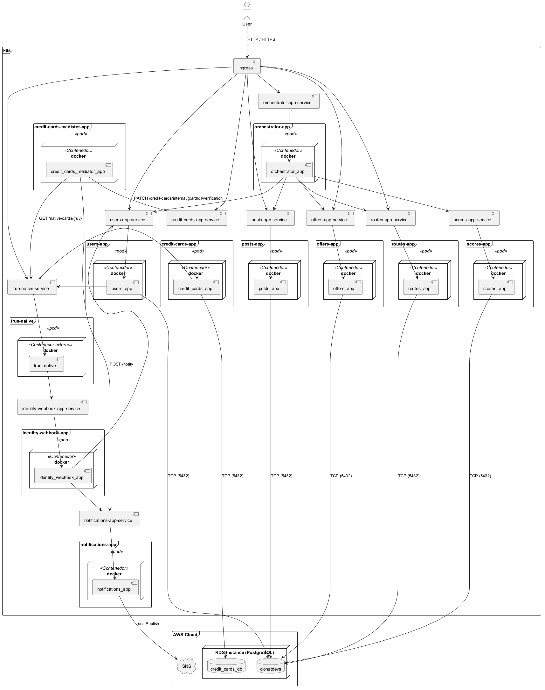
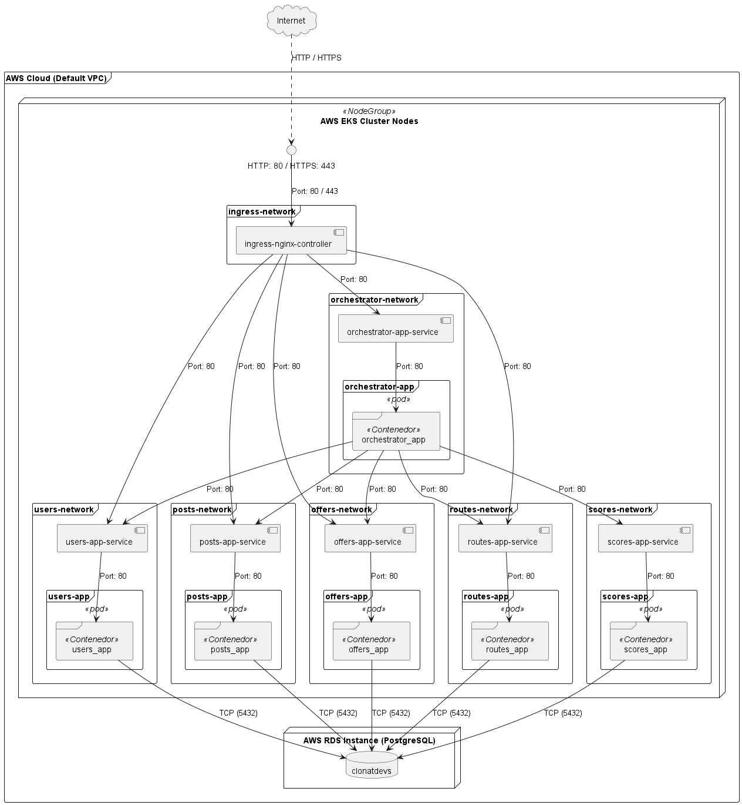

# Vista de despliegue

[← Volver al inicio](./README.md)

La ampliación de la entrega 3 se encuentra en [RF-006: despliegue y operación](./requerimientos/rf-006.md#vista-de-despliegue-y-operación), con EKS, persistencia exclusiva de tarjetas, un worker de polling en contenedor y SNS. El modelo siguiente conserva el alcance de la entrega 2.

## Tabla de contenido

- [Vista de despliegue](#vista-de-despliegue)
  - [Introducción](#introducción)
    - [Componentes de la Entrega 3](#componentes-de-la-entrega-3)
  - [Modelo de despliegue](#modelo-de-despliegue)
  - [Modelo de red](#modelo-de-red)

## Introducción

Esta vista describe cómo se despliegan los componentes de la [vista funcional](./vista-funcional.md) sobre la infraestructura en la nube de AWS, haciendo uso de un clúster de Kubernetes (**AWS EKS**) para los servicios de cómputo y una instancia administrada de **AWS RDS (PostgreSQL)** para la persistencia de datos.

Cada microservicio (`orchestrator`, `users`, `posts`, `offers`, `routes` y `scores`) se ejecuta en un pod independiente dentro del clúster de EKS. El acceso desde el exterior está centralizado mediante un **Ingress Controller** (`ingress-nginx`), el cual recibe el tráfico público en los puertos estándar (`80/443`) y lo enruta hacia los servicios internos. 

`scores_app` no se expone directamente en el Ingress: la `orchestrator_app` lo consume dentro del clúster mediante `scores-app-service`, un servicio de tipo `ClusterIP`.

A diferencia de un esquema local, los `Service` de Kubernetes son de tipo **`ClusterIP`**, evitando exponer puertos individuales (`NodePort`) hacia el exterior. La capa de persistencia se gestiona fuera del clúster EKS a través de la base de datos `clonatdevs` alojada en AWS RDS, garantizando alta disponibilidad y aislamiento del estado.

Los manifiestos utilizados para el despliegue evaluado en AWS se encuentran en `k8s/aws/`, la carpeta declarada en `k8s_manifests` de `config.yaml`. Allí hay un archivo por aplicación (por ejemplo, `k8s/aws/users_app.yml`) y el manifiesto compartido `k8s/aws/ingress.yml`. Los archivos `k8s/*.yaml` corresponden al entorno local.

### Componentes de la Entrega 3

La Entrega 3 agrega cinco componentes desplegados como **contenedores** dentro del mismo clúster EKS — ninguno usa AWS Lambda ni otro cómputo serverless real, aunque dos de ellos (`identity_webhook_app` y `notifications_app`) cumplen un rol equivalente al de una función serverless dentro de la arquitectura (procesar un evento puntual y responder). RF-006 agrega además el `credit_cards_mediator_app`, un worker con su propio bucle de polling (sin SQS ni Lambda), que reclama trabajo de la outbox de `credit_cards_app` por HTTP. La razón es la misma restricción concreta de la cuenta de AWS Academy (Learner Lab): no permite crear roles ni políticas IAM nuevos, y tanto una función Lambda como su disparador (SQS, EventBridge) necesitan su propio rol de ejecución — confirmado en producción, donde los pods corren con `LabEksNodeRole` y no tienen permisos `sqs:SendMessage`. Un contenedor desplegado junto al resto de las apps no necesita ningún rol nuevo — solo reutiliza las credenciales de sesión temporales que ya usa el pipeline para Terraform. El razonamiento completo está documentado en `identity_webhook_app/README.md` ("Por qué es un contenedor y no un Lambda") y se repite en `notifications_app/README.md` y en `rf-006.md` ("Decisión del mecanismo event-driven").

- **`credit_cards_app`**: Deployment + Service `ClusterIP`, expuesto públicamente por el Ingress bajo `/credit-cards`. Persiste en su **propia** base de datos `credit_cards_db` (ver diagrama), separada de `clonatdevs`. El manifiesto `k8s/aws/credit_cards_app.yml`, el registro de imagen y el endpoint interno de finalización ya existen.
- **`true_native`**: Deployment + Service con la imagen oficial del curso (`ghcr.io/misw-4301-desarrollo-apps-en-la-nube/true-native:2.0.0`, sin modificaciones), expuesta públicamente bajo `/native`. No tiene base de datos propia; simula tanto la verificación de identidad como la de tarjetas.
- **`identity_webhook_app`**: Deployment + Service `ClusterIP`, **sin ruta en el Ingress** — solo lo alcanza `true_native` dentro del clúster. Sin base de datos propia.
- **`notifications_app`**: Deployment + Service `ClusterIP`, **sin ruta en el Ingress**. Sin base de datos propia; es el único componente del sistema con permiso `sns:Publish` hacia AWS SNS, un servicio administrado fuera del clúster.
- **`credit_cards_mediator_app`**: Deployment sin Service ni ruta en el Ingress (no atiende peticiones), sin acceso directo a RDS. Un único proceso reclama (`claim`), consulta TrueNative, finaliza y notifica (`ack`/`release`) en un bucle de ~2 segundos, por HTTP contra `credit_cards_app` y `notifications_app`.

## Modelo de despliegue

El modelo de despliegue ilustra la asignación de los componentes de software (entrega 2 y entrega 3) a la infraestructura de AWS EKS y AWS RDS, detallando los puntos de entrada HTTP/HTTPS y las conexiones TCP (5432) hacia las bases de datos PostgreSQL. Incluye además la salida hacia AWS SNS desde `notifications_app`, el único componente que se comunica con un servicio de AWS fuera del clúster.

El archivo fuente se encuentra en [`diagrams/deployment.puml`](./diagrams/deployment.puml).

## Modelo de red

El modelo de red representa las comunicaciones dentro de la VPC de AWS. Los grupos `<aplicación>-network` del diagrama organizan visualmente los componentes; no representan redes independientes ni políticas de aislamiento por aplicación. Los manifiestos de `k8s/aws/` no definen recursos `NetworkPolicy`.

Los controles de red declarados en Terraform operan mediante Security Groups de los nodos y de RDS:

- **Entrada (Ingress):** El tráfico externo solo ingresa al clúster a través del puerto público del Ingress Controller (`80/443`), el cual redistribuye el tráfico a los servicios `ClusterIP` por el puerto `80`.
- **Comunicación interna:** El orquestador se comunica por el puerto `80` de los Services de los demás microservicios. El Security Group de los nodos permite tráfico entre miembros del mismo grupo; esta regla no distingue aplicaciones individuales.
- **Acceso a RDS:** El Security Group de RDS permite conexiones TCP al puerto `5432` desde los rangos de `sg_ingress_cidr_blocks`. En los cuatro ambientes `student`, la lista está vacía, por lo que el módulo utiliza el rango CIDR de la VPC por defecto. El Security Group de los nodos también declara una regla de egreso TCP hacia ese puerto y rango.
- **Propiedad de los datos:** Los servicios `users`, `posts`, `offers`, `routes` y `scores` utilizan RDS para persistencia; el orquestador consume sus APIs. Esta separación es una regla de arquitectura y del código de las aplicaciones. Las reglas de red descritas no garantizan que únicamente esos cinco tipos de pods puedan conectarse a RDS ni restringen el acceso a tablas por microservicio.

El archivo fuente se encuentra en [`diagrams/networks.puml`](./diagrams/networks.puml).

