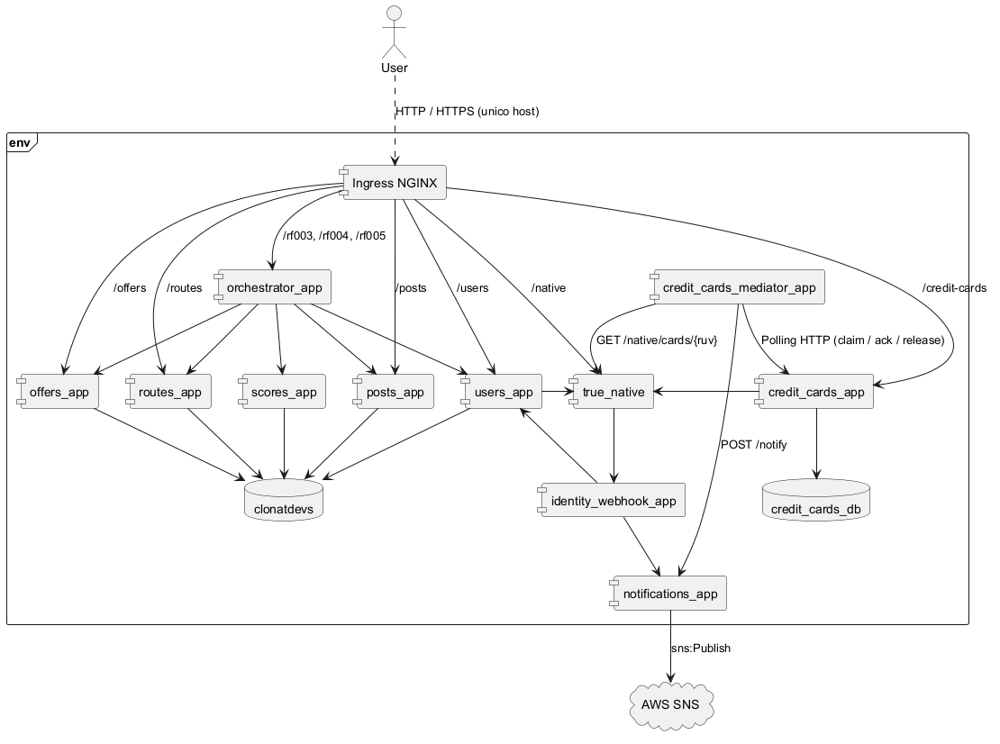

# Vista funcional

[← Volver al inicio](./README.md)

La ampliación de la entrega 3 se encuentra en [RF-006: vista funcional y componentes nuevos](./requerimientos/rf-006.md#vista-funcional-y-componentes). El modelo siguiente conserva el alcance de la entrega 2.

## Tabla de contenido

- [Vista funcional](#vista-funcional)
  - [Tabla de contenido](#tabla-de-contenido)
  - [Introducción](#introducción)
  - [Modelo de componentes](#modelo-de-componentes)
  - [Descripción de los componentes](#descripción-de-los-componentes)
  - [Documentación de componentes nuevos (Entrega 2)](#documentación-de-componentes-nuevos-entrega-2)
    - [**1. Orchestrator App**](#1-orchestrator-app)
    - [**2. Scores App**](#2-scores-app)
    - [**3. Ingress NGINX**](#3-ingress-nginx)
    - [**4. Identity Webhook App**](#4-identity-webhook-app)
    - [**5. Notifications App**](#5-notifications-app)
    - [**6. Credit Cards App**](#6-credit-cards-app)
    - [**7. TrueNative**](#7-truenative)
    - [**8. Credit Cards Mediator**](#8-credit-cards-mediator)

## Introducción

Esta vista presenta los componentes de ejecución del sistema y cómo el usuario interactúa con ellos. Cada servicio se enfoca en un dominio específico exponiendo su propia API REST. Los microservicios de la entrega 2 comparten una única base de datos centralizada llamada `clonatdevs` (con tablas separadas por dueño); `credit_cards_app`, nuevo en la entrega 3, tiene su propia base de datos independiente (`credit_cards_db`).

## Modelo de componentes

El archivo fuente se encuentra en [`diagrams/components.puml`](./diagrams/components.puml).

## Descripción de los componentes

- **Ingress NGINX (`ingress`)**: punto de entrada HTTP que aplica las rutas del recurso `clonatdevs-ingress` y dirige las solicitudes a los Services correspondientes.

- **orchestrator_app**: actúa como punto de entrada y orquestador para el usuario. Recibe las peticiones externas y las redirige o coordina hacia los microservicios correspondientes. Adicionalmente, cuenta con las rutas para los requerimientos 3, 4 y 5.
- **users_app**: gestiona la creación de usuarios, perfiles y la autenticación por token.
- **posts_app**: gestiona la creación y consulta de publicaciones sobre un trayecto.
- **offers_app**: gestiona la creación y consulta de ofertas sobre una publicación.
- **routes_app**: gestiona la creación y consulta de trayectos.
- **scores_app**: calcula, persiste y consulta la utilidad asociada a las ofertas; su acceso es interno a través del orquestador.
- **identity_webhook_app**: recibe el callback asíncrono de TrueNative con el resultado de la verificación de identidad (RF-007), aplica el estado final en `users_app` y notifica el resultado. Componente interno, sin ruta en el Ingress.
- **notifications_app**: recibe el resultado de los procesos de verificación (identidad y tarjeta) y lo publica en un Topic de AWS SNS para notificar por correo (RF-006 y RF-007). Único componente con permiso de publicar en SNS. Componente interno, sin ruta en el Ingress.
- **credit_cards_app**: gestiona la creación y el almacenamiento inicial de tarjetas de crédito (RF-006), con su propia base de datos `credit_cards_db`. La creación síncrona ya invoca TrueNative mediante `/native/cards` y guarda la tarjeta en `POR_VERIFICAR`; el Mediator realiza después el polling y la notificación.
- **TrueNative**: servicio externo provisto por el curso (no es código propio) que simula la verificación de identidad y de tarjetas de crédito. Expuesto en el Ingress bajo `/native/*` porque el enunciado de la entrega lo exige explícitamente.

Los microservicios de la entrega 2 (`users_app`, `posts_app`, `offers_app`, `routes_app` y `scores_app`) utilizan la misma base de datos física `clonatdevs`, pero cada uno accede únicamente a sus propias tablas. `credit_cards_app`, el nuevo componente de la entrega 3, tiene en cambio su **propia base de datos** (`credit_cards_db`), separada de `clonatdevs` — así lo pide explícitamente el enunciado para este componente. `orchestrator_app`, `identity_webhook_app` y `notifications_app` no tienen base de datos propia: obtienen o entregan información exclusivamente mediante las APIs internas de los microservicios dueños de esa información.

## Documentación de componentes nuevos (Entrega 2)

### **1. Orchestrator App**

|||
|--- | ---| 
| **Componente** | Orchestrator App |
| **Código/Id del componente** | `orchestrator_app` |
| **Tipo** | Servicio (Orquestador) |
| **Responsabilidad** | Actúa como orquestador de lógica de negocio y agregador de microservicios. Recibe peticiones enrutadas desde el Ingress Controller y las coordina hacia los servicios internos para flujos complejos. Adicionalmente, cuenta con las rutas para los requerimientos 3, 4 y 5. |
| **Consideraciones de diseño** | **Tradeoffs e impacto:** Simplifica las orquestaciones complejas agrupando llamadas a múltiples microservicios desde una sola petición, pero agrega un salto de red interno adicional (`orchestrator_app` $\rightarrow$ `*-app`). **Alta Disponibilidad:** Se ejecuta dentro de un pod en el clúster AWS EKS, expuesto internamente mediante `orchestrator-app` (`ClusterIP`). Requiere resiliencia (timeouts, reintentos) en caso de fallos de los microservicios aguas abajo. |
| **Integraciones** | **Ingress Controller (`ingress-nginx-controller`):** HTTP/HTTPS - Recibe tráfico externo a través del `orchestrator-app`. **Servicios internos (`users-app`, `posts-app`, `offers-app`, `routes-app`, `scores-app`):** HTTP/REST - Comunicación sincrónica Pod-a-Service. |

---

### **2. Scores App**

|||
|--- | ---| 
| **Componente** | Scores App |
| **Código/Id del componente** | `scores_app` |
| **Tipo** | Servicio (Microservicio) |
| **Responsabilidad** | Gestiona el ciclo de vida de la entidad **Utilidad (Score)**. Calcula la utilidad a partir de los datos de la oferta recibidos desde la `orchestrator_app`, y almacena y consulta el resultado en `clonatdevs` (AWS RDS) para mantener trazabilidad histórica. |
| **Consideraciones de diseño** | **Acceso interno:** Solo es invocado por la `orchestrator_app` mediante el servicio Kubernetes `scores-app-service` de tipo `ClusterIP`; no se publica una ruta de Scores en el Ingress. **Resiliencia:** Si la utilidad no existe o `scores_app` no responde, el orquestador conserva la respuesta de RF005 usando un valor nulo para el score afectado. **Persistencia externa:** Persiste en la instancia administrada AWS RDS (PostgreSQL) para desacoplar el estado del clúster de cómputo EKS. |
| **Integraciones** | **Orchestrator App (`orchestrator_app`):** HTTP/REST - Invocación interna sincrónica hacia `scores-app-service`. **Base de datos (`clonatdevs` en AWS RDS):** Conexión a PostgreSQL mediante TCP en el puerto `5432`. |

### **3. Ingress NGINX**

| Campo | Descripción |
|---|---|
| **Componente** | Ingress NGINX |
| **Código/Id del componente** | `ingress` (identificador en el diagrama de componentes) |
| **Tipo** | Componente de enrutamiento HTTP: controlador ingress-nginx y recurso Ingress `clonatdevs-ingress` |
| **Responsabilidad** | Ofrecer un host de acceso para los endpoints públicos. Enruta `/rf003`, `/rf004` y `/rf005` al orquestador, y `/users`, `/posts`, `/offers` y `/routes` a sus respectivos Services. Scores permanece interno. |
| **Consideraciones de diseño** | Centraliza las reglas de enrutamiento y añade un salto de red. Su disponibilidad afecta el acceso público. El controlador se instala con Helm; las reglas se declaran en `k8s/aws/ingress.yml`. La autenticación y autorización de los nuevos requerimientos se realizan en el orquestador. |
| **Integraciones** | Recibe las solicitudes del cliente a través del Load Balancer y las reenvía por HTTP al puerto `80` de los Services. Conserva el método y la ruta de la solicitud, incluidos los POST de RF-003/RF-004 y el GET de RF-005. No se conecta a RDS ni enruta solicitudes directamente a Scores. |

### **4. Identity Webhook App**

| Campo | Descripción |
|---|---|
| **Componente** | Identity Webhook App |
| **Código/Id del componente** | `identity_webhook_app` |
| **Tipo** | Servicio (webhook receptor) |
| **Responsabilidad** | Recibe el callback asíncrono de TrueNative con el resultado de la verificación de identidad (RF-007), valida su firma, aplica el estado final (`VERIFICADO`/`NO_VERIFICADO`) en `users_app`, y notifica el resultado. |
| **Consideraciones de diseño** | **Por qué existe:** RF-007 exige que `POST /users` responda de inmediato sin esperar el resultado de la verificación; TrueNative lo notifica después llamando a un webhook. Las restricciones de la entrega prohíben ejecutar tareas asíncronas dentro de los componentes web de usuarios y tarjetas, por eso este webhook vive en un componente separado y no dentro de `users_app`. **Por qué contenedor y no Lambda:** la cuenta de AWS Academy no permite crear roles IAM nuevos; un Lambda necesitaría su propio rol de ejecución. Un contenedor normal, desplegado junto al resto de las apps, no necesita ninguno. **Interno:** sin ruta propia en el Ingress; solo lo alcanza TrueNative. |
| **Integraciones** | **TrueNative:** recibe `PATCH /verify-callback` (entrante, HTTP/REST). **users_app:** `GET /users/{id}` y `PATCH /users/{id}` (saliente, HTTP/REST) para leer los datos de contacto y aplicar el estado final. **notifications_app:** `POST /notify` (saliente, HTTP/REST, best-effort: un fallo no revierte el cambio de estado ya aplicado). |

### **5. Notifications App**

| Campo | Descripción |
|---|---|
| **Componente** | Notifications App |
| **Código/Id del componente** | `notifications_app` |
| **Tipo** | Servicio (publicador de notificaciones) |
| **Responsabilidad** | Recibe el resultado de los procesos de verificación (identidad, RF-007, y tarjeta, RF-006) y lo publica en un Topic de AWS SNS con suscripción de email, para notificar al usuario por correo. |
| **Consideraciones de diseño** | **Único publicador de SNS:** es el único componente del sistema con permiso `sns:Publish`, para no repartir credenciales de AWS entre varios servicios. Usa las mismas credenciales de sesión temporales que ya usa el pipeline para Terraform; no se crea ningún rol IAM nuevo. **SNS como servicio de correo:** el Topic tiene una suscripción de tipo `email` hacia `EMAIL_TO_NOTIFY`; SNS entrega el correo directamente, sin necesidad de SES ni SMTP propio. La suscripción exige una confirmación manual (clic en el correo de AWS) después de cada deploy desde cero. **Interno:** sin ruta propia en el Ingress. |
| **Integraciones** | **identity_webhook_app y credit_cards_app:** reciben `POST /notify` (entrante, HTTP/REST síncrono). **AWS SNS:** `sns:Publish` (saliente) al Topic configurado por Terraform. |

### **6. Credit Cards App**

| Campo | Descripción |
|---|---|
| **Componente** | Credit Cards App |
| **Código/Id del componente** | `credit_cards_app` |
| **Tipo** | Servicio (microservicio) |
| **Responsabilidad** | Gestiona la creación y el almacenamiento inicial de tarjetas de crédito (RF-006): valida la solicitud, solicita el token a TrueNative, persiste únicamente los últimos 4 dígitos, la franquicia, el token y el estado `POR_VERIFICAR`. Las transiciones finales `APROBADA`/`RECHAZADA`, el polling y el correo pertenecen al Mediator. |
| **Consideraciones de diseño** | La creación y los endpoints de soporte están implementados con arquitectura hexagonal, Flask, SQLAlchemy y HTTPX síncronos. **Restricción de tiempo:** `POST /credit-cards` debe responder en `≤5` segundos; no espera polling, SQS ni correo. **Sin async/threads:** el componente no ejecuta `asyncio` manual, tareas en segundo plano, hilos ni multiprocessing. |
| **Integraciones** | **Ingress:** expone `/credit-cards/*` públicamente. **users_app:** `GET /users/me` para resolver el propietario del token. **TrueNative:** `POST /native/cards` para tokenización dentro de la petición inicial. **Mediator:** coordinación externa propuesta para polling, actualización de estado y notificación; accede por API y mensajería, nunca por SQL. **notifications_app:** el Mediator llama `POST /notify` después de un resultado, sin bloquear la creación. **Base de datos propia (`credit_cards_db`):** este componente tiene una base separada de `clonatdevs` y es el único propietario de sus tablas. |

### **7. TrueNative**

| Campo | Descripción |
|---|---|
| **Componente** | TrueNative |
| **Código/Id del componente** | `true_native` |
| **Tipo** | Servicio externo simulado (provisto por el curso) |
| **Responsabilidad** | Simula la verificación de identidad de usuarios y el registro/verificación de tarjetas de crédito. Para identidad, responde de forma asíncrona llamando al webhook configurado; para tarjetas, expone consulta por token. |
| **Consideraciones de diseño** | **No es código propio del equipo:** se despliega con la imagen oficial `ghcr.io/misw-4301-desarrollo-apps-en-la-nube/true-native:2.0.0`, sin modificaciones. **Autenticación:** todas las llamadas (entrantes y salientes) se autentican con `SECRET_TOKEN`, un valor que el equipo define libremente (no es un credential real de AWS ni de terceros). **Expuesto en el Ingress:** a diferencia de los demás componentes nuevos, TrueNative sí necesita una ruta pública (`/native/*`) porque el enunciado de la entrega lo exige explícitamente (`GET /native/ping` debe ser accesible vía el host del sistema). |
| **Integraciones** | **Ingress:** expone `/native/*`. **users_app:** recibe `POST /native/verify` (entrante) para iniciar la verificación de identidad. **identity_webhook_app:** llama `PATCH /verify-callback` (saliente) con el resultado. **credit_cards_app:** llama `POST /native/cards` para tokenizar la tarjeta. **Mediator:** consulta posteriormente `GET /native/cards/{ruv}` y procesa los estados devueltos por TrueNative. |

### **8. Credit Cards Mediator**

| Campo | Descripción |
|---|---|
| **Componente** | Credit Cards Mediator |
| **Código/Id del componente** | `credit_cards_mediator_app` |
| **Tipo** | Contenedor worker con bucle de polling propio (sin Service ni Ingress, no atiende peticiones) |
| **Responsabilidad** | Reclama eventos pendientes del outbox de `credit_cards_app` por HTTP, consulta el estado en TrueNative, reprograma (libera) las respuestas `202` y solicita transiciones idempotentes `APROBADA`/`RECHAZADA` a `credit_cards_app`. |
| **Consideraciones de diseño** | No accede directamente a RDS ni conserva el estado de negocio en memoria. El lease del outbox (`claim`/`ack`/`release`) entrega al menos una vez; el endpoint interno idempotente permite recuperar duplicados y fallos. Corre en un `Deployment` normal, sin SQS ni Lambda: los pods de EKS usan `LabEksNodeRole`, que no tiene permisos `sqs:SendMessage` y Academy no permite agregarlos. |
| **Integraciones** | **credit_cards_app:** `POST /credit-cards/internal/verification-events/claim`, `GET`/`PATCH /credit-cards/internal/{cardId}/verification` y `POST .../verification-events/{eventId}/ack` o `/release`, con autenticación de servicio. **TrueNative:** `GET /native/cards/{ruv}` para polling. **users_app:** `GET /users/{userId}` para datos del destinatario. **notifications_app:** `POST /notify` con traducción APROBADA → VERIFICADA y reintentos sin repetir la verificación. |
