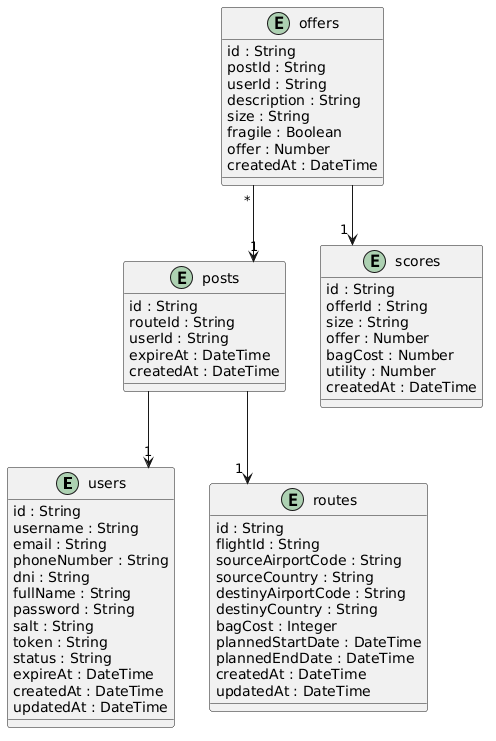

# Vista de información

[← Volver al inicio](./README.md)

La entidad de tarjetas de la entrega 3, sus estados y restricciones de almacenamiento se documentan en [RF-006: contrato y datos](./requerimientos/rf-006.md#contrato-y-datos). La persistencia de tarjetas tiene propiedad y credenciales exclusivas.

## Tabla de contenido

- [Vista de información](#vista-de-información)
  - [Introducción](#introducción)
  - [Modelo de entidades](#modelo-de-entidades)
  - [Descripción de las entidades](#descripción-de-las-entidades)

## Introducción

Esta vista describe los datos que maneja el sistema. En AWS se utiliza una única base de datos física PostgreSQL llamada `clonatdevs`, desplegada en RDS. Dentro de ella, las tablas están lógicamente desacopladas y cada microservicio es dueño exclusivo de sus entidades: solo el servicio propietario puede leerlas o modificarlas directamente. Cuando un componente necesita información de otro dominio, debe solicitarla mediante el API del microservicio propietario y nunca acceder directamente a sus tablas.

## Modelo de entidades

El siguiente modelo presenta las entidades del sistema con sus atributos (nombre y tipo). El archivo fuente se encuentra en [`diagrams/entities.puml`](./diagrams/entities.puml).

## Descripción de las entidades

- **users**: usuario de la plataforma. Puede actuar como Arrendador (ofrece espacio en su maleta) o como Arrendatario (envía un encargo). Guarda las credenciales cifradas (`password`, `salt`) y el token de sesión vigente (`token`, `expireAt`).
- **routes**: trayecto de un vuelo identificado por `flightId`, con su origen, destino, fechas planeadas y el costo de envío de una maleta (`bagCost`).
- **posts**: publicación que un usuario crea sobre un trayecto, indicando hasta qué fecha recibe ofertas (`expireAt`).
- **offers**: oferta que un usuario hace sobre la publicación de otro, describiendo el paquete a enviar (tamaño, si es delicado) y el monto propuesto.
- **scores**: utilidad calculada para una oferta a partir del monto ofrecido, el tamaño del envío y el costo de la maleta. `scores_app` es el único microservicio autorizado para persistir y consultar directamente esta entidad.

Relaciones: una publicación (`posts`) pertenece a un usuario y a un trayecto; una oferta (`offers`) pertenece a una publicación; y una utilidad (`scores`) corresponde a una oferta.
